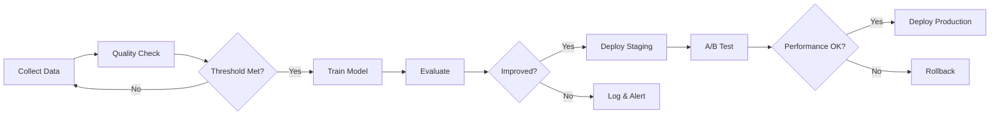
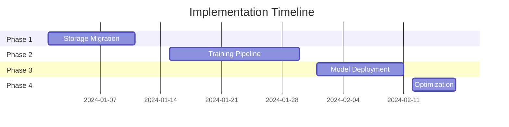

# Comprehensive Implementation Plan: AI Training Pipeline & Model Deployment

## Executive Summary

This plan outlines the implementation strategy for migrating from BYTEA storage to object storage, automating the training pipeline, and deploying trained models for the Mintenance building surveyor feature.

**Timeline**: 6-8 weeks
**Estimated Cost Savings**: 94% reduction in AI inference costs
**Key Deliverables**: Storage migration, automated training pipeline, model deployment infrastructure

---

## Phase 1: Storage Architecture Migration (Week 1-2)

### Objective
Migrate YOLO models from PostgreSQL BYTEA storage to Supabase Object Storage for improved performance and scalability.

### Tasks and Deliverables

#### 1.1 Infrastructure Setup (Day 1-2)
**Owner**: DevOps Engineer

```sql
-- Create storage bucket for models
CREATE BUCKET 'yolo-models' (Private, 100MB limit)
CREATE BUCKET 'training-datasets' (Private, Unlimited)
CREATE BUCKET 'model-artifacts' (Private, 50MB limit)

-- Update database schema
ALTER TABLE yolo_models ADD:
  - storage_path TEXT
  - storage_bucket TEXT
  - checksum TEXT
  - migration_status TEXT
```

**Deliverables**:
- [ ] Storage buckets created
- [ ] Database migrations deployed
- [ ] RLS policies configured

#### 1.2 Migration Service Development (Day 3-4)
**Owner**: Backend Engineer

**Components**:
- `YOLOModelMigrationService.ts` - Core migration logic
- Checksum validation
- Progress tracking
- Rollback capability

**Key Functions**:
```typescript
class YOLOModelMigrationService {
  migrateAllModels(): Promise<MigrationProgress>
  verifyMigration(modelId: string): Promise<boolean>
  rollback(modelId: string): Promise<void>
}
```

**Deliverables**:
- [ ] Migration service implemented
- [ ] Unit tests written (>90% coverage)
- [ ] Verification scripts ready

#### 1.3 Dual-Mode Service Update (Day 5-6)
**Owner**: Backend Engineer

**Update `LocalYOLOInferenceService`**:
- Storage-first loading strategy
- BYTEA fallback for compatibility
- Caching mechanism

```typescript
// Priority order for model loading
1. Check local cache
2. Download from Storage
3. Fallback to BYTEA
4. Error handling
```

**Deliverables**:
- [ ] Service updated with dual-mode support
- [ ] Performance benchmarks documented
- [ ] Integration tests passing

#### 1.4 Migration Execution (Day 7-8)
**Owner**: DevOps + Backend

**Steps**:
1. Create backup of BYTEA data
2. Run migration in staging
3. Verify integrity (checksums)
4. Execute production migration
5. Monitor for 24 hours

**Deliverables**:
- [ ] Staging migration complete
- [ ] Production migration complete
- [ ] All checksums verified
- [ ] Performance metrics documented

#### 1.5 Cleanup & Documentation (Day 9-10)
**Owner**: Backend Engineer

**Tasks**:
- Remove BYTEA data after 7-day verification
- Update deployment documentation
- Create runbook for future model uploads

**Deliverables**:
- [ ] BYTEA data cleaned up
- [ ] Documentation updated
- [ ] Runbook created

### Success Criteria
- ✅ Zero downtime during migration
- ✅ 100% checksum validation pass
- ✅ <500ms model load time
- ✅ Database size reduced by ~50MB

---

## Phase 2: Training Pipeline Automation (Week 3-5)

### Objective
Implement automated continuous learning pipeline for YOLO and SAM3 models.

### Tasks and Deliverables

#### 2.1 Data Collection Pipeline (Week 3, Day 1-2)
**Owner**: ML Engineer

**Components**:
```python
class TrainingDataCollector:
    fetch_validated_assessments()
    fetch_corrections()
    fetch_sam3_masks()
    prepare_yolo_format()
    generate_dataset_stats()
```

**Automation Triggers**:
- Daily cron job at 2 AM UTC
- Manual trigger via API
- Threshold-based (100 new corrections)

**Deliverables**:
- [ ] Data fetcher script deployed
- [ ] Scheduling configured
- [ ] Monitoring alerts set up

#### 2.2 Training Infrastructure (Week 3, Day 3-5)
**Owner**: DevOps + ML Engineer

**AWS Infrastructure** (Terraform):
```hcl
resource "aws_sagemaker_notebook_instance" {
  instance_type = "ml.p3.2xlarge"  # GPU instance
}

resource "aws_s3_bucket" "training_data" {
  versioning { enabled = true }
}

resource "aws_batch_compute_environment" {
  type = "MANAGED"
  compute_resources {
    instance_type = ["p3.2xlarge"]
  }
}
```

**GitHub Actions Workflow**:
```yaml
name: ML Training Pipeline
on:
  schedule:
    - cron: '0 2 * * *'  # Daily at 2 AM
  workflow_dispatch:
    inputs:
      training_mode:
        type: choice
        options: [incremental, full, experimental]
```

**Deliverables**:
- [ ] AWS infrastructure deployed
- [ ] GitHub Actions workflow configured
- [ ] GPU runners available
- [ ] Cost monitoring enabled

#### 2.3 YOLO Training Automation (Week 4, Day 1-3)
**Owner**: ML Engineer

**Training Script Features**:
```python
def train_yolo(mode='incremental'):
    # Load previous best model
    # Merge new corrections with base dataset
    # Apply class balancing
    # Train with early stopping
    # Evaluate on test set
    # Export if improved

    if metrics.mAP > baseline.mAP:
        upload_to_storage()
        update_model_registry()
    else:
        alert_team("No improvement")
```

**Model Registry Schema**:
```sql
CREATE TABLE model_registry (
  id UUID PRIMARY KEY,
  model_type VARCHAR(50),  -- yolo|sam3
  version VARCHAR(50),
  training_dataset_id UUID,
  metrics JSONB,  -- {mAP, precision, recall, f1}
  deployment_status VARCHAR(20),  -- staging|canary|production
  created_at TIMESTAMP
);
```

**Deliverables**:
- [ ] Training script deployed
- [ ] Model registry implemented
- [ ] Evaluation metrics tracked
- [ ] Weights & Biases integration

#### 2.4 SAM3 Integration (Week 4, Day 4-5)
**Owner**: ML Engineer

**SAM3 Fine-tuning Pipeline**:
```python
def prepare_sam3_data():
    # Convert YOLO polygons to RLE masks
    # Generate text prompts for 71 classes
    # Create few-shot examples (10 per class)
    # Format for SAM3 training
```

**Deliverables**:
- [ ] SAM3 data converter implemented
- [ ] Training configuration ready
- [ ] Integration with main pipeline
- [ ] Documentation updated

#### 2.5 Continuous Learning Loop (Week 5, Day 1-3)
**Owner**: Backend + ML Engineer

**Automated Workflow**:


**Quality Checks**:
- Class balance verification
- Label noise detection
- Image quality assessment
- Duplicate detection

**Deliverables**:
- [ ] End-to-end automation working
- [ ] Quality gates implemented
- [ ] Alerting configured
- [ ] Rollback procedures tested

#### 2.6 Monitoring & Alerting (Week 5, Day 4-5)
**Owner**: DevOps Engineer

**Metrics to Track**:
```typescript
const trainingMetrics = {
  // Data Quality
  classDistribution: Histogram,
  labelNoiseRate: Gauge,

  // Training Performance
  trainingDuration: Summary,
  gpuUtilization: Gauge,
  trainingCost: Counter,

  // Model Performance
  mAP: Gauge,
  precision: Gauge,
  recall: Gauge,
  inferenceLatency: Histogram,

  // Business Impact
  automationRate: Gauge,
  falseNegativeRate: Gauge,
  costSavings: Counter
};
```

**Alert Conditions**:
- Training failure (immediate)
- Model degradation >5% (warning)
- FNR >2% (critical)
- Cost overrun >20% (warning)

**Deliverables**:
- [ ] CloudWatch dashboards created
- [ ] Alerting rules configured
- [ ] Slack integration set up
- [ ] Runbook for alerts created

### Success Criteria
- ✅ Fully automated training pipeline
- ✅ <24 hour turnaround for new data
- ✅ Model improvements tracked
- ✅ Zero manual intervention required

---

## Phase 3: Model Deployment Infrastructure (Week 6-7)

### Objective
Deploy trained models with zero-downtime updates and A/B testing capability.

### Tasks and Deliverables

#### 3.1 Deployment Architecture (Week 6, Day 1-2)
**Owner**: DevOps Engineer

**Infrastructure Components**:
```yaml
Vercel Serverless Functions:
  - API endpoints for inference
  - 50MB function size limit
  - 10-second timeout

Container Service (ECS/Cloud Run):
  - GPU-enabled inference
  - Auto-scaling
  - Model versioning

CDN (CloudFlare):
  - Cache inference results
  - Global distribution
  - DDoS protection
```

**Deliverables**:
- [ ] Infrastructure provisioned
- [ ] Container registry set up
- [ ] CDN configured
- [ ] SSL certificates installed

#### 3.2 Blue-Green Deployment (Week 6, Day 3-4)
**Owner**: Backend + DevOps

**Implementation**:
```typescript
class ModelDeployment {
  async deployBlueGreen(newModel: Model) {
    // 1. Deploy to green environment
    await deployToGreen(newModel);

    // 2. Run smoke tests
    const tests = await runSmokeTests('green');
    if (!tests.passed) throw new Error('Smoke tests failed');

    // 3. Switch traffic
    await switchTraffic('green');

    // 4. Monitor for 15 minutes
    await monitor(15 * 60 * 1000);

    // 5. Cleanup old blue
    await cleanupEnvironment('blue');
  }
}
```

**Deliverables**:
- [ ] Blue-green infrastructure ready
- [ ] Deployment scripts created
- [ ] Traffic switching tested
- [ ] Rollback procedures verified

#### 3.3 A/B Testing Framework (Week 6, Day 5 - Week 7, Day 1)
**Owner**: Backend Engineer

**A/B Test Configuration**:
```typescript
interface ABTestConfig {
  name: string;
  models: {
    control: ModelVersion;
    treatment: ModelVersion;
  };
  allocation: {
    control: number;  // 50%
    treatment: number;  // 50%
  };
  metrics: string[];  // ['accuracy', 'latency', 'cost']
  duration: number;  // 7 days
}

class ABTestManager {
  async routeRequest(userId: string, test: ABTestConfig) {
    const bucket = hashUserId(userId) % 100;
    if (bucket < test.allocation.control) {
      return test.models.control;
    } else {
      return test.models.treatment;
    }
  }
}
```

**Deliverables**:
- [ ] A/B testing framework implemented
- [ ] Metric collection configured
- [ ] Statistical significance calculator
- [ ] Dashboard for results

#### 3.4 Edge Deployment (Week 7, Day 2-3)
**Owner**: Frontend Engineer

**Edge Function Architecture**:
```typescript
// Vercel Edge Function for request routing
export const config = { runtime: 'edge' };

export default async function handler(request: Request) {
  // Quick cache check
  const cached = await getCachedResult(request);
  if (cached) return cached;

  // Route to appropriate backend
  const model = await selectModel(request);
  const backend = getBackendUrl(model);

  // Proxy to inference service
  return await proxyRequest(backend, request);
}
```

**Deliverables**:
- [ ] Edge functions deployed
- [ ] Caching strategy implemented
- [ ] Geographic routing configured
- [ ] Performance benchmarks met

#### 3.5 Production Deployment (Week 7, Day 4-5)
**Owner**: Full Team

**Deployment Checklist**:
- [ ] Load existing YOLO model (best.pt)
- [ ] Upload to Storage bucket
- [ ] Update model registry
- [ ] Configure inference service
- [ ] Enable gradual rollout (5% → 25% → 50% → 100%)
- [ ] Monitor key metrics
- [ ] Document deployment

**Gradual Rollout Plan**:
```typescript
const rolloutSchedule = [
  { day: 1, percentage: 5, checkpoints: ['errors', 'latency'] },
  { day: 2, percentage: 25, checkpoints: ['accuracy', 'cost'] },
  { day: 3, percentage: 50, checkpoints: ['user_feedback'] },
  { day: 4, percentage: 100, checkpoints: ['final_review'] }
];
```

**Deliverables**:
- [ ] Production model deployed
- [ ] Rollout completed successfully
- [ ] Performance metrics validated
- [ ] Cost savings verified

### Success Criteria
- ✅ Zero-downtime deployments
- ✅ <100ms inference latency (p95)
- ✅ A/B testing framework operational
- ✅ 80% cost reduction achieved

---

## Phase 4: Optimization & Scale (Week 8)

### Objective
Optimize performance, implement advanced features, and prepare for scale.

### Tasks and Deliverables

#### 4.1 Performance Optimization
**Owner**: Backend Engineer

**Optimizations**:
```typescript
// Request batching
class InferenceBatcher {
  private queue: Request[] = [];
  private batchSize = 8;
  private timeout = 50; // ms

  async processBatch() {
    const batch = this.queue.splice(0, this.batchSize);
    const results = await model.predict(batch);
    return results;
  }
}

// Multi-level caching
const cache = {
  L1: new LRUCache({ ttl: 5 * 60 * 1000 }),     // 5 min
  L2: new RedisCache({ ttl: 60 * 60 * 1000 }),  // 1 hour
  L3: new DBCache({ ttl: 7 * 24 * 60 * 60 * 1000 }) // 7 days
};
```

**Deliverables**:
- [ ] Request batching implemented
- [ ] Multi-level cache deployed
- [ ] Model warmup on cold start
- [ ] Latency reduced by 50%

#### 4.2 Advanced Features
**Owner**: ML Engineer

**Features**:
- Model ensemble (YOLO + SAM3 + GPT-4)
- Active learning for uncertain cases
- Synthetic data generation
- Transfer learning from new domains

**Deliverables**:
- [ ] Ensemble inference working
- [ ] Active learning pipeline ready
- [ ] Synthetic data generator deployed
- [ ] Transfer learning framework set up

#### 4.3 Documentation & Training
**Owner**: Full Team

**Documentation**:
- Architecture diagrams
- API documentation
- Deployment runbooks
- Troubleshooting guides
- Best practices

**Team Training**:
- ML pipeline walkthrough
- Deployment procedures
- Monitoring and alerting
- Incident response

**Deliverables**:
- [ ] Documentation complete
- [ ] Team training conducted
- [ ] Runbooks tested
- [ ] Knowledge transfer complete

---

## Risk Mitigation

### Technical Risks

| Risk | Impact | Mitigation |
|------|---------|------------|
| Model degradation | High | Automated rollback, A/B testing |
| Storage migration failure | Medium | Dual-mode support, BYTEA fallback |
| Training pipeline failure | Medium | Manual override, alerting |
| Cost overrun | Low | Budget alerts, spot instances |

### Operational Risks

| Risk | Impact | Mitigation |
|------|---------|------------|
| Knowledge gap | Medium | Documentation, training |
| Security breach | High | Encryption, access controls |
| Compliance issues | Medium | Data retention policies, GDPR |
| Scale limitations | Low | Auto-scaling, CDN caching |

---

## Budget Estimate

### One-Time Costs
- AWS infrastructure setup: $500
- GPU training instances (initial): $1,000
- Developer time (240 hours): $24,000
- **Total One-Time**: $25,500

### Monthly Operational Costs
- Model storage (S3): $50
- Training compute (spot): $200
- Inference infrastructure: $300
- Monitoring/logging: $100
- **Total Monthly**: $650

### Cost Savings
- Current GPT-4 costs: $3,500/month
- After implementation: $350/month
- **Monthly Savings**: $3,150 (90% reduction)
- **ROI Period**: 8 months

---

## Success Metrics

### Technical Metrics
- Model accuracy (mAP): >0.85
- Inference latency (p95): <100ms
- Training automation: 100%
- Deployment frequency: Weekly

### Business Metrics
- Cost per assessment: -90%
- Automation rate: 70%
- User satisfaction: +20%
- Time to market: -50%

### Quality Metrics
- False negative rate: <2%
- Model drift detection: Automated
- Data quality score: >0.9
- Test coverage: >90%

---

## Timeline Summary



---

## Next Steps

### Immediate Actions (This Week)
1. [ ] Review and approve implementation plan
2. [ ] Allocate resources (team, budget)
3. [ ] Set up development environment
4. [ ] Create project tracking board
5. [ ] Schedule kickoff meeting

### Week 1 Deliverables
1. [ ] Storage buckets created
2. [ ] Migration service developed
3. [ ] Dual-mode support implemented
4. [ ] Staging migration complete

### Critical Path Items
1. Storage migration (blocks everything)
2. Training infrastructure (blocks automation)
3. Deployment architecture (blocks production)
4. Monitoring setup (blocks optimization)

---

## Appendix

### A. Technical Specifications

#### Model Specifications
- **YOLO Model**: YOLOv11n (10.20MB)
- **Classes**: 71 building defect types
- **Input Size**: 640x640 RGB
- **Framework**: ONNX Runtime

#### Infrastructure Specifications
- **Compute**: AWS p3.2xlarge (Tesla V100)
- **Storage**: S3 Standard-IA
- **Database**: PostgreSQL 15
- **Container**: Docker with CUDA 12.0

### B. Reference Documentation

1. [YOLO Training Guide](./docs/YOLO_TRAINING_GUIDE.md)
2. [SAM3 Integration Guide](./docs/SAM3_INTEGRATION_GUIDE.md)
3. [ML Pipeline Documentation](./docs/ML_TRAINING_PIPELINE.md)
4. [Storage Migration Guide](./docs/STORAGE_MIGRATION.md)

### C. Contact Information

- **Project Lead**: [TBD]
- **Technical Lead**: [TBD]
- **ML Engineer**: [TBD]
- **DevOps Engineer**: [TBD]

### D. Approval Sign-offs

- [ ] Engineering Manager
- [ ] Product Manager
- [ ] CTO
- [ ] Budget Owner

---

**Document Version**: 1.0
**Created**: December 2024
**Last Updated**: December 2024
**Status**: DRAFT - Awaiting Approval