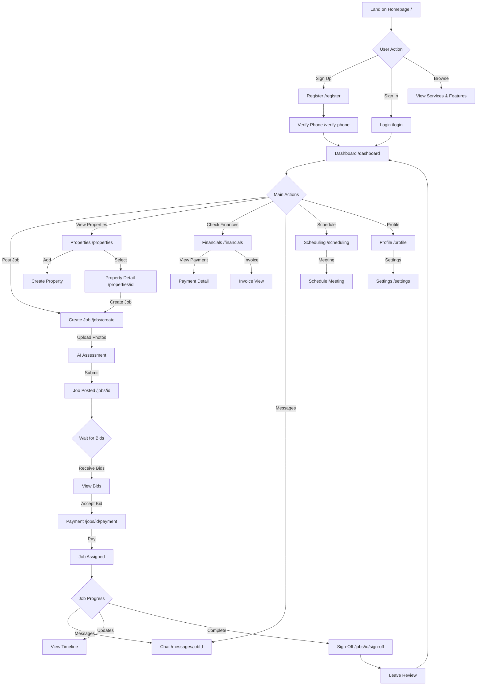
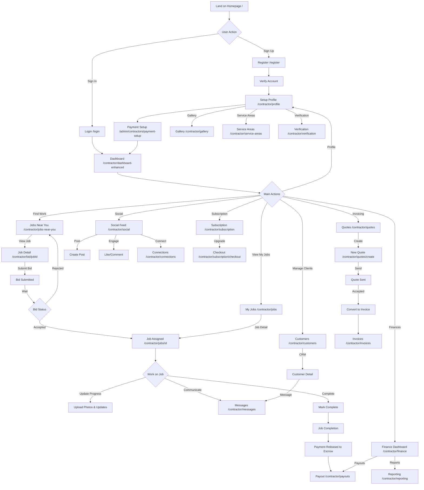

# Mintenance Platform - Complete Navigation Map

**Generated:** 2025-11-28
**Version:** 1.0

---

## 📊 Executive Summary

| User Type | Total Pages | Dashboard | Features | Shared |
|-----------|-------------|-----------|----------|--------|
| **Homeowner** | 18 main pages | 1 | 12 | 5 |
| **Contractor** | 28 main pages | 2 | 21 | 5 |
| **Public** | 12 pages | - | - | - |
| **Admin** | 11 pages | 1 | 10 | - |

---

## 🏠 PUBLIC PAGES (Pre-Authentication)

### Landing Page (`/`)
**Features:**
- Urgency Banner (limited-time offers)
- Hero Section with CTA
- Quick Quote Widget (60-second estimate)
- Stats Section (platform metrics)
- How It Works Section
- AI Assessment Showcase
- Customer Testimonials
- Services Section
- Features Section
- Live Activity Feed (FOMO widget)

**Navigation Links:**
- Login → `/login`
- Register → `/register`
- How It Works → `#how-it-works`
- Services → `#services`
- Features → `#features`
- About → `/about`
- Contact → `/contact`
- Help → `/help`

---

### Authentication Pages

#### Login (`/login`)
**Links:**
- Register → `/register`
- Forgot Password → `/forgot-password`
- After login (Homeowner) → `/dashboard`
- After login (Contractor) → `/contractor/dashboard-enhanced`
- After login (Admin) → `/admin`

#### Register (`/register`)
**Links:**
- Login → `/login`
- Terms → `/terms`
- Privacy → `/privacy`

#### Forgot Password (`/forgot-password`)
**Links:**
- Back to Login → `/login`

#### Reset Password (`/reset-password`)
**Links:**
- Login → `/login`

#### Verify Phone (`/verify-phone`)
**Links:**
- Dashboard → `/dashboard` (after verification)

---

### Information Pages

#### About (`/about`)
- Company information
- Back to Home → `/`

#### Contact (`/contact`)
- Contact form
- Back to Home → `/`

#### Privacy Policy (`/privacy`)
- Privacy information
- Back to Home → `/`

#### Terms of Service (`/terms`)
- Terms and conditions
- Back to Home → `/`

#### Help Center (`/help`)
**Features:**
- Article categories
- Search functionality
- Popular articles

**Links:**
- Article Detail → `/help/[category]/[slug]`
- Category browsing
- Back to Home → `/`

---

## 👤 HOMEOWNER PAGES (Sidebar Navigation)

### Main Sidebar Navigation
The UnifiedSidebar provides consistent navigation across all homeowner pages:

1. **Dashboard** → `/dashboard`
2. **Messages** → `/messages` (Badge: unread count)
3. **Job Details** (Dropdown)
   - All Jobs → `/jobs`
   - Active → `/jobs?status=active`
   - Completed → `/jobs?status=completed`
4. **Jobs** → `/jobs`
5. **Scheduling** → `/scheduling`
6. **Properties** → `/properties`
7. **Financials** → `/financials`
8. **Profiles** → `/profile`
9. **Settings** → `/settings`

---

### 1. Dashboard (`/dashboard`)
**Primary Page for Homeowners**

**Features:**
- Welcome header with user name
- 4 Primary KPI Cards:
  - Active Jobs count
  - Total Spent
  - Properties count
  - Upcoming tasks
- Secondary Metrics (6 cards)
- Current Job Status tracker
- Revenue Overview Chart
- Activity Feed

**Navigation Links:**
- View Job Details → `/jobs/[id]`
- Post New Job → `/jobs/create`
- View Financials → `/financials`
- View Profile → `/profile`
- All Jobs → `/jobs`

**Connected Features:**
- Onboarding Wrapper (first-time users)
- Real-time notifications

---

### 2. Jobs (`/jobs`)
**Job Management Hub**

**Features:**
- Job list with filters
- Status filters (all, posted, assigned, in_progress, completed)
- Search functionality
- Job cards with:
  - Photo preview
  - Title and description
  - Location
  - Budget
  - Status badge

**Navigation Links:**
- Create New Job → `/jobs/create`
- Job Detail → `/jobs/[id]`
- Messages for Job → `/messages/[jobId]`

**Job Status Flow:**
1. Posted → Awaiting bids
2. Assigned → Contractor selected
3. In Progress → Work underway
4. Completed → Work finished

---

### 3. Create Job (`/jobs/create`)
**Job Posting Wizard**

**Features:**
- Job title and description
- Photo upload (up to 10 images, 5MB each)
- AI Building Surveyor Assessment
  - Analyzes uploaded photos
  - Provides damage assessment
  - Suggests budget and category
  - Estimates urgency
- Property selection (optional)
- Location with:
  - Manual entry
  - Google Places autocomplete
  - "Use My Location" button
- Category selection (11 categories):
  - Handyman, Plumbing, Electrical, Painting & Decorating
  - Carpentry, Cleaning, Gardening, Roofing, Heating & Gas, Flooring
- Urgency (low, medium, high)
- Required Contractor Skills (up to 10, optional)
- Budget (£)
- Smart Job Analysis (AI suggestions)

**Form Validation:**
- Title required (max 100 chars)
- Description required (max 500 chars)
- Location required
- Category required
- Budget required (minimum £1)

**Navigation Links:**
- Back to Jobs → `/jobs`
- After Creation → `/jobs/[id]`
- Cancel → `/jobs`
- Property Details → `/properties/[id]`

**Pre-requisites:**
- Email verified
- Phone verified (can post after verification)

---

### 4. Job Detail (`/jobs/[id]`)
**Individual Job Management**

**Features:**
- Job information display
- Photo gallery
- Bid list from contractors
- Bid swipe cards (Tinder-style)
- Contractor viewers list (who viewed the job)
- Job location map (Google Maps)
- Intelligent matching suggestions
- Job view tracker
- Payment processing

**Navigation Links:**
- View All Bids → `/jobs/[id]`
- Accept Bid → Payment flow
- Message Contractor → `/messages/[jobId]`
- Make Payment → `/jobs/[id]/payment`
- Job Sign-Off → `/jobs/[id]/sign-off`
- View Contractor Profile → `/contractors/[id]`
- Edit Job → (if status allows)

**Actions:**
- Accept bid
- Reject bid
- Message contractor
- Complete job
- Request changes

---

### 5. Job Payment (`/jobs/[id]/payment`)
**Payment Processing**

**Features:**
- Payment amount display
- Stripe payment integration
- Escrow handling
- Payment method selection

**Navigation Links:**
- Back to Job → `/jobs/[id]`
- After Payment → `/checkout/return`
- Payment Details → `/payments/[transactionId]`

---

### 6. Job Sign-Off (`/jobs/[id]/sign-off`)
**Job Completion & Review**

**Features:**
- Mark job as complete
- Rate contractor
- Leave review
- Release escrow payment

**Navigation Links:**
- Back to Job → `/jobs/[id]`
- After Sign-Off → `/jobs/[id]`

---

### 7. Find Contractors (`/find-contractors`)
**Contractor Discovery**

**Features:**
- Contractor search
- Filter by location
- Filter by skills
- Contractor cards
- Map view

**Navigation Links:**
- Contractor Profile → `/contractors/[id]`
- View All Contractors → `/contractors`

---

### 8. Contractors List (`/contractors`)
**Browse All Contractors**

**Features:**
- Contractor cards with:
  - Profile photo
  - Company name
  - Rating
  - Skills
  - Location
- Contractor map view
- Neighborhood recommendations
- Filters and search

**Navigation Links:**
- Contractor Detail → `/contractors/[id]`
- Contractor Location → `/contractors/[id]/location`

---

### 9. Contractor Profile (`/contractors/[id]`)
**View Contractor Details**

**Features:**
- Profile information
- Portfolio
- Reviews and ratings
- Skills and certifications
- Service areas
- Contact button

**Navigation Links:**
- Message Contractor → `/messages`
- Request Quote → `/jobs/create`
- View Portfolio → Portfolio modal

---

### 10. Messages (`/messages`)
**Communication Hub**

**Features:**
- Conversation list
- Unread badge
- Message threads
- Real-time messaging
- File attachments

**Navigation Links:**
- Conversation Detail → `/messages/[jobId]`
- Related Job → `/jobs/[id]`

**Conversation View (`/messages/[jobId]`):**
- Message thread
- Job context card
- Contractor info
- Send message
- Attach files

---

### 11. Properties (`/properties`)
**Property Management**

**Features:**
- Property cards with:
  - Property name
  - Address
  - Active jobs count
  - Completed jobs count
  - Total spent
  - Last service date
- Add property button
- Property stats summary

**Navigation Links:**
- Property Detail → `/properties/[id]`
- Add Property → Property creation modal
- Create Job for Property → `/jobs/create?property_id=[id]`

---

### 12. Property Detail (`/properties/[id]`)
**Individual Property**

**Features:**
- Property information
- Property photos
- Job history for property
- Maintenance schedule
- Property documents

**Navigation Links:**
- Create Job → `/jobs/create?property_id=[id]`
- View Job → `/jobs/[id]`
- Edit Property → Edit modal
- Back to Properties → `/properties`

---

### 13. Scheduling (`/scheduling`)
**Calendar & Appointments**

**Features:**
- Calendar view
- Job schedule
- Meetings
- Subscription billing dates
- Filter by event type

**Navigation Links:**
- Job Detail → `/jobs/[id]`
- Meeting Detail → `/scheduling/meetings/[id]`
- Schedule Meeting → `/scheduling/meetings`
- Video Call → `/video-calls`

**Meetings (`/scheduling/meetings`):**
- Meeting list
- Meeting scheduler
- Calendar integration
- Meeting history

---

### 14. Financials (`/financials`)
**Financial Dashboard**

**Features:**
- Billing overview:
  - Total spent
  - This month spending
  - Pending payments
  - Next payment
- Payment history
- Invoices received
- Subscriptions
- Payment methods
- Trend sparklines

**Navigation Links:**
- Payment Detail → `/payments/[transactionId]`
- Invoice Detail → Invoice modal
- Add Payment Method → `/settings/payment-methods`
- Job Detail → `/jobs/[id]`

---

### 15. Payments (`/payments`)
**Payment Management**

**Features:**
- Payment list
- Payment status
- Payment history
- Refund requests

**Navigation Links:**
- Payment Detail → `/payments/[transactionId]`
- Related Job → `/jobs/[id]`
- Request Refund → `/disputes/create`

---

### 16. Payment Detail (`/payments/[transactionId]`)
**Individual Payment**

**Features:**
- Payment information
- Transaction details
- Receipt download
- Dispute option

**Navigation Links:**
- Back to Payments → `/payments`
- Related Job → `/jobs/[id]`
- Create Dispute → `/disputes/create`

---

### 17. Profile (`/profile`)
**User Profile Management**

**Features:**
- Personal information
- Profile photo
- Contact details
- Account settings
- Verification status

**Navigation Links:**
- Edit Profile → Profile edit form
- Settings → `/settings`
- Verify Phone → `/verify-phone`

---

### 18. Settings (`/settings`)
**Account Settings**

**Features:**
- Account preferences
- Notification settings
- GDPR compliance settings
- Privacy controls
- Security settings

**Sub-pages:**
- Payment Methods → `/settings/payment-methods`

**Navigation Links:**
- Back to Dashboard → `/dashboard`
- Logout → `/logout`

---

## 🔨 CONTRACTOR PAGES (Sidebar Navigation)

### Main Sidebar Navigation
The UnifiedSidebar for contractors:

1. **Dashboard** → `/contractor/dashboard-enhanced`
2. **Messages** → `/contractor/messages`
3. **Jobs** (Dropdown)
   - All Jobs → `/contractor/jobs`
   - Active → `/contractor/jobs?status=in_progress`
   - Completed → `/contractor/jobs?status=completed`
   - Find Jobs → `/contractor/jobs-near-you`
4. **Scheduling** → `/scheduling`
5. **Customers** → `/contractor/customers`
6. **Financials** → `/contractor/finance`
7. **Company** → `/contractor/profile`
8. **Reporting** → `/contractor/reporting`
9. **Settings** → `/settings`

---

### 1. Dashboard (`/contractor/dashboard-enhanced`)
**Primary Contractor Hub**

**Features:**
- Welcome header with:
  - Active jobs count
  - Pending bids count
  - This month revenue
- Trial/Subscription status banner
- Payment setup banner (if not configured)
- Project table (top 5 jobs)
- Today's tasks widget
- Overall progress:
  - Circular progress chart
  - Stats grid (Total, Completed, Delayed, Ongoing)
  - Progress trend chart (6 months)
- Activity feed
- Quick actions

**Navigation Links:**
- View Jobs → `/contractor/jobs`
- Jobs Near You → `/contractor/jobs-near-you`
- Job Detail → `/contractor/jobs/[id]`
- Setup Payments → `/admin/contractors/payment-setup`
- Upgrade Subscription → `/contractor/subscription`

**Banners:**
- Trial Status (days remaining)
- Subscription Expired Reminder
- Payment Setup Required

---

### 2. Jobs Near You (`/contractor/jobs-near-you`)
**Job Discovery & Bidding**

**Features:**
- Available jobs feed
- Location-based filtering
- Skill matching
- Job cards with:
  - Distance from contractor
  - Skill match indicator
  - Budget range
  - Posted time
- Bid submission form
- Job details preview

**Navigation Links:**
- View Job Detail → `/contractor/bid/[jobId]`
- Submit Bid → Bid form modal
- View on Map → Map view

**Filtering:**
- Distance radius
- Job category
- Budget range
- Posted date
- Skills required

---

### 3. Bid Submission (`/contractor/bid/[jobId]`)
**Detailed Bid Creation**

**Features:**
- Job information display
- Bid amount input
- Estimated timeline
- Proposal/cover letter
- Portfolio attachment
- Terms acceptance
- AI-powered bid suggestions

**Navigation Links:**
- Back to Jobs Near You → `/contractor/jobs-near-you`
- After Submission → `/contractor/jobs-near-you`
- View Similar Jobs → `/contractor/jobs-near-you`

---

### 4. Bids Overview (`/contractor/bid`)
**Bid Management**

**Features:**
- Submitted bids list
- Bid status (pending, accepted, rejected)
- Bid history
- Performance metrics

**Navigation Links:**
- Bid Detail → `/contractor/bid/[jobId]`
- Related Job → `/contractor/jobs/[id]`

---

### 5. My Jobs (`/contractor/jobs`)
**Active Job Management**

**Features:**
- Jobs table with:
  - Job title
  - Homeowner info
  - Status
  - Budget
  - Created/Updated dates
- Status filters (all, in_progress, completed)
- Search functionality
- Pagination
- Sorting

**Navigation Links:**
- Job Detail → `/contractor/jobs/[id]`
- Find New Jobs → `/contractor/jobs-near-you`
- Messages → `/contractor/messages`

**Status Types:**
- In Progress
- Completed
- Assigned
- Posted

---

### 6. Job Detail (`/contractor/jobs/[id]`)
**Individual Job Management**

**Features:**
- Job information
- Client details
- Company info card
- Portfolio section
- Skills display
- Job progress bar
- Photo upload
- Timeline updates
- Milestone tracking

**Navigation Links:**
- Back to Jobs → `/contractor/jobs`
- Message Client → `/contractor/messages`
- Update Progress → Progress modal
- Upload Photos → Photo uploader
- Complete Job → Completion flow

**Components:**
- Company Info Card
- Job Photo Upload
- Job Progress Bar
- Portfolio Section
- Skills Display

---

### 7. Messages (`/contractor/messages`)
**Client Communication**

**Features:**
- Conversation list with homeowners
- Active contract cards
- Real-time messaging
- Create contract dialog/modal
- File sharing
- Message search

**Navigation Links:**
- Conversation Detail → Message thread
- Related Job → `/contractor/jobs/[id]`
- Create Contract → Contract creation modal

**Features:**
- Active Contract Card
- Create Contract Dialog
- Create Contract Modal

---

### 8. Customers (`/contractor/customers` - NEW)
**Client Relationship Management**

**Features:**
- Customer list
- Customer details
- Job history per customer
- Communication history
- Customer stats

**Navigation Links:**
- Customer Detail → Customer profile
- Related Jobs → `/contractor/jobs`
- Message Customer → `/contractor/messages`

**Components:**
- Customer Row
- Messages Sidebar

---

### 9. Discover (`/contractor/discover`)
**Explore Opportunities**

**Features:**
- Curated job recommendations
- Trending jobs in area
- Skill-matched opportunities
- Empty state guidance

**Navigation Links:**
- Job Detail → `/contractor/bid/[jobId]`
- Jobs Near You → `/contractor/jobs-near-you`

---

### 10. Connections (`/contractor/connections`)
**Network Management**

**Features:**
- Professional connections
- Follow/Unfollow contractors
- Connection requests
- Networking opportunities

**Navigation Links:**
- Contractor Profile → `/contractor/[id]`
- Social Feed → `/contractor/social`

---

### 11. Social (`/contractor/social`)
**Professional Social Network**

**Features:**
- Contractor feed
- Posts and updates
- Comments section
- Share functionality
- Follow button
- Notifications dropdown
- Like and engage

**Navigation Links:**
- Post Detail → `/contractor/social/post/[id]`
- Contractor Profile → `/contractor/[id]`
- Share Modal → Share dialog
- Notifications → Notifications panel

**Components:**
- Contractor Feed
- Comments Section
- Follow Button
- Notifications Dropdown
- Share Dialog
- Share Modal

---

### 12. Post Detail (`/contractor/social/post/[id]`)
**Individual Social Post**

**Features:**
- Full post content
- Comments
- Engagement metrics
- Share options

**Navigation Links:**
- Back to Feed → `/contractor/social`
- Author Profile → `/contractor/[id]`

---

### 13. Quotes (`/contractor/quotes`)
**Quote Management**

**Features:**
- Quote list
- Quote status tracking
- Quote builder
- Template management

**Navigation Links:**
- Quote Detail → `/contractor/quotes/[id]`
- Create Quote → `/contractor/quotes/create`
- Quote Builder → Quote builder interface

**Quote Detail (`/contractor/quotes/[id]`):**
- Quote information
- Line items
- Client details
- Send/Resend quote
- Convert to invoice

**Create Quote (`/contractor/quotes/create`):**
- Client selection
- Service items
- Pricing
- Terms and conditions
- Send to client

---

### 14. Invoices (`/contractor/invoices`)
**Invoice Management**

**Features:**
- Invoice list
- Invoice creation
- Payment tracking
- Invoice templates

**Navigation Links:**
- Invoice Detail → Invoice modal
- Create Invoice → Invoice creation
- Related Job → `/contractor/jobs/[id]`
- Related Quote → `/contractor/quotes/[id]`

---

### 15. Finance (`/contractor/finance`)
**Financial Dashboard**

**Features:**
- Revenue overview
- Payment history
- Pending payments
- Average job value
- Monthly revenue chart (6 months)
- Profit margin
- Expense tracking
- Tax information

**Metrics:**
- Total Revenue
- Pending Payments
- Average Job Value
- Profit Margin
- Monthly breakdown

**Navigation Links:**
- Payout Settings → `/contractor/payouts`
- Payment Detail → Payment modal
- Invoice Detail → `/contractor/invoices`
- Related Job → `/contractor/jobs/[id]`

---

### 16. Payouts (`/contractor/payouts`)
**Payout Management**

**Features:**
- Payout history
- Stripe Connect integration
- Bank account setup
- Payout schedule
- Pending escrow amounts

**Navigation Links:**
- Setup Payout → `/admin/contractors/payment-setup`
- Payout Success → `/contractor/payout/success`
- Refresh Payout → `/contractor/payout/refresh`

**Payout Success (`/contractor/payout/success`):**
- Confirmation message
- Next steps
- Dashboard link

**Payout Refresh (`/contractor/payout/refresh`):**
- Re-authenticate Stripe
- Update bank details

---

### 17. Profile (`/contractor/profile`)
**Company Profile Management**

**Features:**
- Company information
- Profile photo/logo
- Bio and description
- Skills and certifications
- Service areas
- Portfolio gallery
- Reviews display
- Profile quick actions
- Verification status

**Navigation Links:**
- Edit Profile → Profile edit form
- Add Portfolio Item → Portfolio uploader
- Service Areas → `/contractor/service-areas`
- Gallery → `/contractor/gallery`
- Verification → `/contractor/verification`
- Settings → `/settings`

---

### 18. Verification (`/contractor/verification`)
**Professional Verification**

**Features:**
- Document upload
- ID verification
- License verification
- Insurance verification
- Background check

**Navigation Links:**
- Back to Profile → `/contractor/profile`
- After Verification → `/contractor/profile`

---

### 19. Gallery (`/contractor/gallery`)
**Portfolio Gallery**

**Features:**
- Photo grid
- Project photos
- Before/after galleries
- Photo categorization
- Upload interface

**Navigation Links:**
- Back to Profile → `/contractor/profile`
- Upload Photos → Upload modal

---

### 20. Service Areas (`/contractor/service-areas`)
**Service Area Management**

**Features:**
- Map interface
- Service radius
- Locations served
- Travel preferences

**Navigation Links:**
- Back to Profile → `/contractor/profile`
- Save Changes → Update service areas

---

### 21. Resources (`/contractor/resources`)
**Business Resources**

**Features:**
- Business guides
- Templates
- Industry news
- Best practices
- Training materials

**Navigation Links:**
- Article Detail → Article view
- Back to Dashboard → `/contractor/dashboard-enhanced`

---

### 22. Reporting (`/contractor/reporting`)
**Analytics & Reports**

**Features:**
- Business performance metrics
- Revenue reports
- Job completion rates
- Customer satisfaction
- Time tracking
- Export functionality

**Navigation Links:**
- Dashboard → `/contractor/dashboard-enhanced`
- Finance → `/contractor/finance`

---

### 23. CRM (`/contractor/crm`)
**Customer Relationship Management**

**Features:**
- Customer database
- Interaction tracking
- Follow-up reminders
- Customer segmentation
- Communication history

**Navigation Links:**
- Customer Detail → Customer profile
- Messages → `/contractor/messages`
- Jobs → `/contractor/jobs`

---

### 24. Subscription (`/contractor/subscription`)
**Subscription Management**

**Features:**
- Current plan display
- Plan features
- Upgrade/Downgrade options
- Billing history
- Payment methods
- Trial status
- Cancellation

**Navigation Links:**
- Checkout → `/contractor/subscription/checkout`
- Payment Methods → `/contractor/subscription/payment-methods`
- Back to Dashboard → `/contractor/dashboard-enhanced`

**Subscription Checkout (`/contractor/subscription/checkout`):**
- Plan selection
- Payment information
- Stripe checkout
- Confirmation

**Payment Methods (`/contractor/subscription/payment-methods`):**
- Saved cards
- Add payment method
- Set default
- Remove payment method

---

### 25. Support (`/contractor/support`)
**Customer Support**

**Features:**
- Help articles
- Contact support
- Ticket system
- FAQ

**Navigation Links:**
- Help Center → `/help`
- Create Ticket → Ticket form
- Back to Dashboard → `/contractor/dashboard-enhanced`

---

### 26. Market Insights (`/contractor/market-insights`)
**Business Intelligence**

**Features:**
- Market trends
- Competitive analysis
- Pricing insights
- Demand forecasting

**Navigation Links:**
- Back to Dashboard → `/contractor/dashboard-enhanced`

---

### 27. Escrow Status (`/contractor/escrow/status`)
**Escrow Transaction Tracking**

**Features:**
- Pending escrow amounts
- Escrow history
- Release status
- Dispute management

**Navigation Links:**
- Related Job → `/contractor/jobs/[id]`
- Finance Dashboard → `/contractor/finance`

---

### 28. Card Editor (`/contractor/card-editor`)
**Business Card Designer**

**Features:**
- Digital business card
- Customization tools
- QR code generation
- Share functionality

**Navigation Links:**
- Back to Profile → `/contractor/profile`
- Preview → Card preview
- Download → Card download

---

## 🔄 SHARED FEATURES (Both User Types)

### 1. Video Calls (`/video-calls`)
**Video Conferencing**

**Features:**
- Video call interface
- Screen sharing
- Call history
- Schedule video calls
- WebRTC integration

**Navigation Links:**
- Join Call → Video interface
- Schedule Call → `/video-calls` scheduler
- Call History → Call history list
- Back to Dashboard → `/dashboard` or `/contractor/dashboard-enhanced`

**Components:**
- Video Call Interface
- Video Call History
- Video Call Scheduler

---

### 2. Notifications (`/notifications`)
**Notification Center**

**Features:**
- All notifications
- Mark as read
- Notification filters
- Real-time updates

**Navigation Links:**
- Related Item → Context-specific link
- Mark All Read → Action
- Settings → `/settings` (notification preferences)

---

### 3. Analytics (`/analytics`)
**Usage Analytics**

**Features:**
- Platform usage insights
- Performance metrics
- Activity tracking

**Navigation Links:**
- Dashboard → Role-specific dashboard
- Reports → Report generation

---

### 4. AI Search (`/ai-search`)
**AI-Powered Search**

**Features:**
- Intelligent search
- AI search suggestions
- Context-aware results
- Search history

**Navigation Links:**
- Search Result → Context-specific page
- Advanced Search → Filters

---

### 5. Discover (`/discover`)
**Content Discovery**

**Features:**
- Personalized recommendations
- Trending content
- Explore features

**Navigation Links:**
- Item Detail → Context-specific page
- Category View → Filtered view

---

## 👨‍💼 ADMIN PAGES

### Admin Dashboard (`/admin`)
**Admin Overview**

**Features:**
- Platform statistics
- User management preview
- Revenue overview
- System health

**Navigation Links:**
- Users → `/admin/users`
- Revenue → `/admin/revenue`
- Security → `/admin/security`
- Settings → `/admin/settings`

---

### Admin Authentication

#### Admin Login (`/admin/(auth)/login`)
**Links:**
- Admin Dashboard → `/admin`

#### Admin Register (`/admin/(auth)/register`)
**Links:**
- Admin Login → `/admin/(auth)/login`

#### Admin Forgot Password (`/admin/(auth)/forgot-password`)
**Links:**
- Admin Login → `/admin/(auth)/login`

---

### User Management (`/admin/users`)
**User Administration**

**Features:**
- User list
- User roles
- Account status
- User search

**Navigation Links:**
- User Detail → User profile view
- Dashboard → `/admin`

---

### Building Assessments (`/admin/building-assessments`)
**AI Assessment Management**

**Features:**
- Assessment queue
- Training data
- Model accuracy
- Review assessments

**Navigation Links:**
- Assessment Detail → Assessment view
- Data Annotation → `/admin/data-annotation`
- Correct Assessment → `/building-assessments/[id]/correct`

---

### Data Annotation (`/admin/data-annotation`)
**Training Data Labeling**

**Features:**
- Image annotation
- Damage classification
- Quality control
- Export datasets

**Navigation Links:**
- Back to Assessments → `/admin/building-assessments`

---

### Communications (`/admin/communications`)
**Platform Communications**

**Features:**
- Broadcast messages
- Email templates
- Notification management
- Communication logs

**Navigation Links:**
- Dashboard → `/admin`

---

### Revenue Management (`/admin/revenue`)
**Revenue Analytics**

**Features:**
- Revenue dashboard
- Transaction tracking
- Synthetic data generation
- Training data accuracy
- Data export

**Navigation Links:**
- Dashboard → `/admin`
- Export → Data export API

---

### Security (`/admin/security`)
**Security Dashboard**

**Features:**
- Security metrics
- Threat detection
- Audit logs
- Access control

**Navigation Links:**
- Dashboard → `/admin`

---

### Payment Setup (`/admin/contractors/payment-setup`)
**Contractor Payment Configuration**

**Features:**
- Stripe Connect onboarding
- Bank account linking
- Payout configuration
- Tax information

**Navigation Links:**
- Back to Admin → `/admin`
- Contractor Dashboard → `/contractor/dashboard-enhanced`

---

### Escrow Reviews (`/admin/escrow/reviews`)
**Escrow Management**

**Features:**
- Pending escrow transactions
- Review escrow releases
- Dispute resolution
- Transaction history

**Navigation Links:**
- Transaction Detail → Transaction view
- Dashboard → `/admin`

---

### Fee Management (`/admin/payments/fees`)
**Platform Fee Configuration**

**Features:**
- Fee transfer management
- Fee structures
- Revenue allocation
- Fee reports

**Navigation Links:**
- Dashboard → `/admin`

---

### Settings (`/admin/settings`)
**Platform Settings**

**Features:**
- System configuration
- Feature flags
- Integration settings
- Platform preferences

**Navigation Links:**
- Dashboard → `/admin`

---

## 📱 ADDITIONAL PAGES

### Checkout (`/checkout`)
**Payment Checkout**

**Features:**
- Stripe payment processing
- Order summary
- Payment confirmation

**Navigation Links:**
- Return → `/checkout/return`
- Back to Job → Context-specific

**Checkout Return (`/checkout/return`):**
- Payment confirmation
- Success/failure message
- Next steps

---

### Disputes (`/disputes/create`)
**Dispute Creation**

**Features:**
- Dispute form
- Evidence upload
- Issue description
- Resolution request

**Navigation Links:**
- Back → Previous page
- After Submission → Dispute tracking

**Dispute Detail (`/disputes/[id]`):**
- Dispute information
- Status tracking
- Resolution updates
- Communication thread

---

### Timeline (`/timeline/[jobId]`)
**Job Timeline Tracker**

**Features:**
- Milestone tracking
- Progress visualization
- Timeline events
- Status updates

**Navigation Links:**
- Back to Job → `/jobs/[jobId]`

---

### Performance Monitoring (`/performance`)
**System Performance**

**Features:**
- Performance metrics
- Page load times
- Budget compliance
- Real-time dashboard

**Navigation Links:**
- Dashboard → Role-specific

---

### Offline (`/offline`)
**Offline Mode**

**Features:**
- Offline message
- Cached content
- Reconnection detection

**Navigation Links:**
- Retry → Reload page
- Dashboard → When online

---

### Logout (`/logout`)
**Sign Out**

**Features:**
- Clear session
- Redirect to login

**Navigation Links:**
- Login → `/login`
- Home → `/`

---

## 🗺️ USER JOURNEY FLOWS

### Homeowner Journey Flow



---

### Contractor Journey Flow



---

## 🔗 CROSS-LINKING MATRIX

### Job-Related Links

| From Page | To Page | Action | User Type |
|-----------|---------|--------|-----------|
| Dashboard | /jobs/create | Post Job | Homeowner |
| Jobs List | /jobs/[id] | View Job | Both |
| Job Detail | /messages/[jobId] | Message | Both |
| Job Detail | /jobs/[id]/payment | Make Payment | Homeowner |
| Job Detail | /contractors/[id] | View Contractor | Homeowner |
| Jobs Near You | /contractor/bid/[jobId] | Submit Bid | Contractor |
| My Jobs | /contractor/jobs/[id] | View Job | Contractor |

---

### Communication Links

| From Page | To Page | Action | User Type |
|-----------|---------|--------|-----------|
| Any Page | /messages | Open Messages | Both |
| Messages | /messages/[jobId] | View Conversation | Both |
| Messages | /jobs/[id] | View Related Job | Both |
| Job Detail | /messages/[jobId] | Start Conversation | Both |
| Contractor Profile | /messages | Contact | Homeowner |

---

### Financial Links

| From Page | To Page | Action | User Type |
|-----------|---------|--------|-----------|
| Dashboard | /financials | View Finances | Homeowner |
| Dashboard | /contractor/finance | View Finances | Contractor |
| Job Detail | /jobs/[id]/payment | Make Payment | Homeowner |
| Financials | /payments/[id] | View Payment | Homeowner |
| Finance | /contractor/payouts | View Payouts | Contractor |
| Quotes | /contractor/invoices | Convert Quote | Contractor |

---

### Profile & Settings Links

| From Page | To Page | Action | User Type |
|-----------|---------|--------|-----------|
| Dashboard | /profile | Edit Profile | Homeowner |
| Dashboard | /contractor/profile | Edit Profile | Contractor |
| Profile | /settings | Account Settings | Both |
| Profile | /contractor/verification | Verify Account | Contractor |
| Profile | /contractor/gallery | Manage Gallery | Contractor |
| Settings | /settings/payment-methods | Payment Methods | Both |

---

## 🎯 FEATURE AVAILABILITY MATRIX

| Feature | Homeowner | Contractor | Admin |
|---------|-----------|------------|-------|
| **Job Management** |
| Create Job | ✅ | ❌ | ✅ |
| View Jobs | ✅ (Own) | ✅ (Assigned) | ✅ (All) |
| Accept/Reject Bids | ✅ | ❌ | ✅ |
| Submit Bids | ❌ | ✅ | ❌ |
| **Communication** |
| Messages | ✅ | ✅ | ✅ |
| Video Calls | ✅ | ✅ | ❌ |
| **Financial** |
| Make Payments | ✅ | ❌ | ✅ |
| Receive Payments | ❌ | ✅ | ❌ |
| View Financials | ✅ | ✅ | ✅ |
| Manage Invoices | ❌ | ✅ | ✅ |
| Manage Quotes | ❌ | ✅ | ❌ |
| **Properties** |
| Manage Properties | ✅ | ❌ | ✅ |
| View Property History | ✅ | ❌ | ✅ |
| **Social** |
| Social Feed | ❌ | ✅ | ❌ |
| Connections | ❌ | ✅ | ❌ |
| **Scheduling** |
| Calendar | ✅ | ✅ | ❌ |
| Schedule Meetings | ✅ | ✅ | ❌ |
| **Business Tools** |
| CRM | ❌ | ✅ | ❌ |
| Reporting | ❌ | ✅ | ✅ |
| Market Insights | ❌ | ✅ | ❌ |
| **Platform** |
| AI Search | ✅ | ✅ | ✅ |
| Analytics | ✅ | ✅ | ✅ |
| Notifications | ✅ | ✅ | ✅ |
| **Administration** |
| User Management | ❌ | ❌ | ✅ |
| Revenue Dashboard | ❌ | ❌ | ✅ |
| Building Assessments | ❌ | ❌ | ✅ |
| Security Dashboard | ❌ | ❌ | ✅ |

---

## 🚀 KEY USER FLOWS

### 1. Homeowner: Post a Job & Hire Contractor

```
START → Dashboard → Create Job
     → Fill Form (Title, Description, Photos, Location, Category, Budget)
     → AI Assessment (Optional: Analyze photos, get suggestions)
     → Submit Job
     → Job Posted → Wait for Bids
     → View Bids → Select Contractor
     → Make Payment → Escrow Held
     → Job Assigned → Track Progress
     → Message Contractor (if needed)
     → Job Completed → Sign-Off
     → Leave Review → Payment Released
     → END
```

---

### 2. Contractor: Find & Complete a Job

```
START → Dashboard → Jobs Near You
     → Browse Available Jobs → Filter by Location/Skills
     → View Job Detail → Submit Bid
     → Wait for Acceptance
     → Bid Accepted → Job Assigned (My Jobs)
     → View Job Details → Message Homeowner
     → Update Progress → Upload Photos
     → Mark Job Complete → Request Sign-Off
     → Homeowner Signs Off → Payment Released to Escrow
     → Receive Payout (via Stripe Connect)
     → END
```

---

### 3. Full Payment Flow (Homeowner → Contractor)

```
Homeowner Side:
Job Posted → Bid Accepted → Payment Page → Enter Payment Details (Stripe)
         → Payment Processed → Funds Held in Escrow → Job Assigned

Job Progress → Updates → Completion Request

Sign-Off Page → Approve Work → Rate Contractor → Release Payment

Contractor Side:
Bid Accepted → Job Assigned → Work → Upload Updates → Request Completion
           → Awaiting Sign-Off → Sign-Off Received → Payment Released
           → Escrow → Payout Account (Stripe Connect) → Bank Account
```

---

## 📊 NAVIGATION STATISTICS

### Page Count by Category

| Category | Count | Percentage |
|----------|-------|------------|
| **Core Pages** | 69 | 100% |
| Homeowner Pages | 18 | 26% |
| Contractor Pages | 28 | 41% |
| Shared Pages | 5 | 7% |
| Public Pages | 12 | 17% |
| Admin Pages | 11 | 16% |

---

### Most Connected Pages (Hub Pages)

| Page | Incoming Links | Outgoing Links | Total |
|------|----------------|----------------|-------|
| Dashboard (Homeowner) | 12 | 15 | 27 |
| Dashboard (Contractor) | 15 | 18 | 33 |
| Jobs List | 8 | 12 | 20 |
| Job Detail | 10 | 14 | 24 |
| Messages | 14 | 8 | 22 |
| Profile | 6 | 10 | 16 |

---

### User Action Frequency (Estimated)

| Action | Frequency | Primary Users |
|--------|-----------|---------------|
| View Dashboard | Daily | Both |
| Check Messages | Daily | Both |
| Post Job | Weekly | Homeowner |
| Submit Bid | Daily | Contractor |
| Make Payment | Per Job | Homeowner |
| Update Job Progress | Daily | Contractor |
| View Financials | Weekly | Both |
| Schedule Meeting | As Needed | Both |

---

## 🔍 SEARCH ENTRY POINTS

Users can access features through multiple paths:

### 1. Primary Navigation (Sidebar)
- Always visible
- Role-specific links
- Badge indicators for notifications

### 2. Dashboard Quick Actions
- CTA buttons for common tasks
- Activity feed links
- Metric cards (clickable)

### 3. Search & Discovery
- Global search bar
- AI-powered search (`/ai-search`)
- Discover page (`/discover`)

### 4. Contextual Links
- Job cards → Job detail
- Contractor cards → Contractor profile
- Message threads → Related jobs
- Payment history → Payment details

### 5. Notifications
- Real-time alerts
- Clickable to relevant pages
- Badge counters on navigation

---

## 🎨 UI PATTERNS

### Consistent Layouts

1. **UnifiedSidebar**
   - Used by: Homeowners, Contractors
   - Fixed left navigation
   - Role-specific menu items
   - User profile section
   - Notification/Help/Settings icons

2. **PageHeader**
   - Dark background variant
   - Title + Actions pattern
   - User avatar + dropdown
   - Search bar (contextual)

3. **Card-Based Layouts**
   - Job cards
   - Contractor cards
   - Property cards
   - Payment cards
   - Consistent hover states

4. **Modal/Dialog Patterns**
   - Add Property
   - Create Contract
   - Share Post
   - Image Upload
   - Confirmation dialogs

---

## 🔐 PROTECTED ROUTES

### Authentication Required

| Route Pattern | Access Control |
|---------------|----------------|
| `/dashboard` | Homeowner only |
| `/contractor/*` | Contractor only |
| `/admin/*` | Admin only |
| `/jobs/create` | Homeowner only (verified) |
| `/messages` | Authenticated users |
| `/profile` | Authenticated users |
| `/settings` | Authenticated users |

### Verification Required

- **Email Verification:** Required for all authenticated actions
- **Phone Verification:** Required to post jobs (homeowners)
- **Payment Setup:** Required to receive payouts (contractors)
- **Professional Verification:** Optional but recommended (contractors)

---

## 🌟 STANDOUT FEATURES

### AI-Powered Features
1. **AI Building Surveyor** (`/jobs/create`)
   - Photo analysis
   - Damage assessment
   - Cost estimation
   - Urgency detection

2. **Smart Job Analysis** (`/jobs/create`)
   - Auto-categorization
   - Budget suggestions
   - Urgency recommendations

3. **AI Search** (`/ai-search`)
   - Contextual search results
   - Intelligent suggestions

### Real-Time Features
1. **Live Activity Feed** (Landing page)
   - Real-time job postings
   - FOMO effect

2. **Real-Time Messaging**
   - WebSocket-based chat
   - Typing indicators
   - Read receipts

3. **Notifications**
   - Push notifications
   - Badge counters
   - Real-time updates

### Unique Contractor Tools
1. **Social Feed** (`/contractor/social`)
   - Professional networking
   - Portfolio sharing
   - Industry updates

2. **CRM System** (`/contractor/crm`)
   - Customer management
   - Follow-up tracking
   - Relationship building

3. **Market Insights** (`/contractor/market-insights`)
   - Competitive analysis
   - Pricing trends
   - Demand forecasting

4. **Card Editor** (`/contractor/card-editor`)
   - Digital business card
   - QR code generation
   - Easy sharing

---

## 📈 CONVERSION FUNNELS

### Homeowner Conversion

```
Landing Page (/)
    ↓ (Sign Up CTA)
Register (/register)
    ↓ (Verify)
Dashboard (/dashboard)
    ↓ (Post Job CTA)
Create Job (/jobs/create)
    ↓ (AI Assessment, Form Fill)
Job Posted (/jobs/[id])
    ↓ (Receive Bids)
Accept Bid & Pay (/jobs/[id]/payment)
    ↓ (Job Completion)
Sign-Off & Review (/jobs/[id]/sign-off)
    ↓
Repeat Customer (Dashboard)
```

**Conversion Rate Optimizations:**
- Quick Quote Widget on landing
- AI assessment reduces friction
- Urgency banner creates FOMO
- Social proof through testimonials
- Live activity feed

---

### Contractor Conversion

```
Landing Page (/)
    ↓ (Sign Up as Contractor)
Register (/register)
    ↓ (Profile Setup)
Profile Setup (/contractor/profile)
    ↓ (Payment Setup)
Payment Setup (/admin/contractors/payment-setup)
    ↓ (Onboarding Complete)
Dashboard (/contractor/dashboard-enhanced)
    ↓ (Find Jobs)
Jobs Near You (/contractor/jobs-near-you)
    ↓ (Submit Bid)
Bid Submission (/contractor/bid/[jobId])
    ↓ (Bid Accepted)
Complete Job (/contractor/jobs/[id])
    ↓ (Payment Received)
Payout (/contractor/payouts)
    ↓
Active Contractor (Dashboard)
```

**Conversion Rate Optimizations:**
- Trial subscription (14 days free)
- Easy payment setup flow
- Job matching based on skills
- Transparent pricing
- Quick bid submission

---

## 🎯 SUCCESS METRICS BY PAGE

### Key Performance Indicators

| Page | Primary Metric | Secondary Metric |
|------|----------------|------------------|
| Landing | Sign-ups | Quote requests |
| Job Create | Jobs posted | AI assessments used |
| Jobs Near You | Bids submitted | Job views |
| Job Detail | Bids accepted | Messages sent |
| Payment | Payments completed | Escrow held |
| Sign-Off | Reviews submitted | Payment released |
| Dashboard | Daily active users | Feature engagement |
| Messages | Messages sent | Response time |
| Social Feed | Posts created | Engagement rate |

---

## 🔄 REDIRECT FLOWS

### Role-Based Redirects

```javascript
// Automatic redirects based on user role:

1. Login Success:
   - Homeowner → /dashboard
   - Contractor → /contractor/dashboard-enhanced
   - Admin → /admin

2. Unauthorized Access:
   - /contractor/* as Homeowner → /dashboard
   - /dashboard as Contractor → /contractor/dashboard-enhanced
   - /admin/* as non-admin → /login

3. Context-Specific:
   - /jobs as Contractor → /contractor/bid
   - /financials as Contractor → /contractor/finance
```

---

## 🎨 DESIGN SYSTEM NOTES

### Theme & Styling
- **Primary Color:** Teal (#0D9488)
- **Secondary Color:** Navy Blue (#1e293b)
- **Accent:** Emerald (#10B981)
- **Background:** Gray-50 (#F9FAFB)
- **Card Hover:** Shadow-lg + translate-y

### Typography
- **Headings:** Bold, tracking-tight
- **Body:** Regular, line-height 1.5
- **Small Text:** 0.875rem (14px)
- **Metric Numbers:** 2xl to 4xl, font-weight 640

### Spacing
- **Page Padding:** 32px (2rem)
- **Card Padding:** 24px (1.5rem)
- **Gap:** 24px (1.5rem)
- **Max Width:** 1440px (large screens)

### Components
- **Buttons:** Rounded-lg, shadow-sm
- **Cards:** Rounded-xl, border, hover effects
- **Inputs:** Rounded-lg, border
- **Badges:** Rounded-full, small text
- **Avatars:** Rounded-full, 40px (default)

---

## 📱 RESPONSIVE BREAKPOINTS

```css
/* Mobile: < 768px */
- Single column layouts
- Mobile menu toggle
- Stacked cards
- Simplified navigation

/* Tablet: 768px - 1024px */
- 2-column grids
- Condensed sidebar
- Responsive tables

/* Desktop: > 1024px */
- Fixed sidebar (240px)
- Multi-column grids
- Full feature set
- Hover interactions
```

---

## 🚀 PERFORMANCE OPTIMIZATIONS

### Code Splitting
- Dynamic imports for heavy components
- Route-based code splitting
- Lazy loading for images

### Caching Strategy
```javascript
// Cache revalidation times:
- User profile: 300s (5 min)
- Properties: 300s (5 min)
- Jobs: 60s (1 min)
- Messages: Real-time
- Dashboard data: 60s (1 min)
```

### Performance Budgets
Defined in `/WEEK_4_8_PERFORMANCE_OPTIMIZATION_PLAN.md`

---

## 🔍 SEO & METADATA

### Page Titles
```
- Landing: "Mintenance - Home Maintenance Platform"
- Dashboard: "Dashboard | Mintenance"
- Jobs: "Jobs | Mintenance"
- Contractor Dashboard: "Enhanced Dashboard | Mintenance"
- Messages: "Messages | Mintenance"
```

### Meta Descriptions
- Landing page optimized for search
- Dynamic descriptions for job pages
- Contractor profiles indexed
- Help articles optimized

---

## 🎁 ONBOARDING FLOWS

### Homeowner Onboarding
```
1. Register → /register
2. Verify Email → Email link
3. Verify Phone → /verify-phone
4. Welcome to Dashboard → /dashboard (Onboarding wrapper)
5. Create First Job → /jobs/create (Highlighted CTA)
6. Post Job → /jobs/[id]
7. Onboarding Complete
```

### Contractor Onboarding
```
1. Register → /register
2. Verify Email → Email link
3. Setup Profile → /contractor/profile (Onboarding wrapper)
   - Company info
   - Skills
   - Service areas
4. Setup Payments → /admin/contractors/payment-setup
   - Stripe Connect
   - Bank account
5. Start Trial → 14 days free
6. Find First Job → /contractor/jobs-near-you (Highlighted)
7. Onboarding Complete
```

---

## 🏁 CONCLUSION

This navigation map provides a complete overview of the Mintenance platform architecture, including:

- **69 total pages** across 5 user types
- **Comprehensive user journeys** from landing to conversion
- **Feature availability matrix** by role
- **Visual flow diagrams** for key processes
- **Cross-linking patterns** for seamless navigation
- **Performance and UX optimizations**

### Quick Reference Links

**Homeowner Start:** `/` → `/register` → `/dashboard` → `/jobs/create`
**Contractor Start:** `/` → `/register` → `/contractor/profile` → `/contractor/jobs-near-you`
**Admin Start:** `/admin/(auth)/login` → `/admin`

---

**Document End**
For updates or questions, refer to the codebase in `apps/web/app/`
