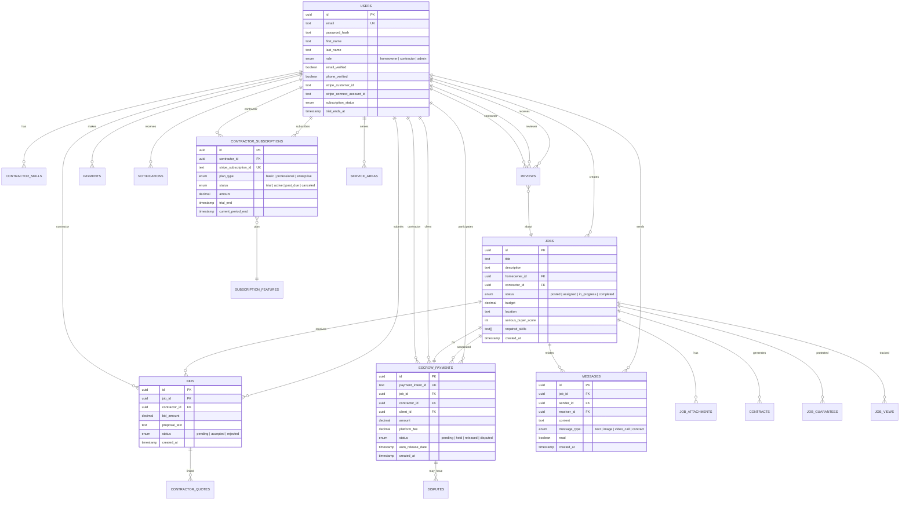

# Mintenance Platform - Technical Architecture Documentation

**Version:** 1.0
**Last Updated:** 2025-11-28
**Platform:** Full-Stack Web Application (Next.js 14 + Supabase PostgreSQL)

---

## Table of Contents

1. [Executive Summary](#executive-summary)
2. [System Architecture Overview](#system-architecture-overview)
3. [Database Schema & ERD](#database-schema--erd)
4. [API Layer Architecture](#api-layer-architecture)
5. [Service Layer Architecture](#service-layer-architecture)
6. [Frontend Architecture](#frontend-architecture)
7. [Data Flow Diagrams](#data-flow-diagrams)
8. [Integration Points](#integration-points)
9. [Authentication & Authorization](#authentication--authorization)
10. [Code Patterns & Examples](#code-patterns--examples)

---

## 1. Executive Summary

Mintenance is a two-sided marketplace platform connecting homeowners with contractors for home maintenance and repair jobs. The platform features:

- **Job Posting & Bidding**: Homeowners post jobs, contractors submit bids
- **Escrow Payment System**: Secure payment holding with Stripe integration
- **AI-Powered Matching**: ML-based contractor matching and job analysis
- **Real-time Communication**: Messaging, notifications, and video calls
- **Contractor Verification**: Background checks, skill verification, portfolio validation
- **Subscription Management**: Contractor subscription tiers with Stripe billing
- **Building Assessment AI**: Computer vision-based damage assessment (YOLO models)

**Tech Stack:**
- **Frontend:** Next.js 14 (App Router), React 18, TypeScript, Tailwind CSS
- **Backend:** Next.js API Routes, Supabase Edge Functions
- **Database:** Supabase PostgreSQL with Row-Level Security (RLS)
- **Payments:** Stripe (Payment Intents, Connect, Subscriptions)
- **Storage:** Supabase Storage (images, documents)
- **Real-time:** Supabase Realtime (WebSocket subscriptions)
- **AI/ML:** Google Cloud Vision API, Custom YOLO models, TensorFlow.js

---

## 2. System Architecture Overview

### High-Level Architecture

```
┌─────────────────────────────────────────────────────────────────┐
│                         CLIENT LAYER                            │
│  ┌──────────────┐  ┌──────────────┐  ┌──────────────────────┐  │
│  │  Web App     │  │  Mobile App  │  │  Admin Dashboard     │  │
│  │  (Next.js)   │  │  (Planned)   │  │  (Next.js)           │  │
│  └──────────────┘  └──────────────┘  └──────────────────────┘  │
└─────────────────────────────────────────────────────────────────┘
                              ↓ HTTPS
┌─────────────────────────────────────────────────────────────────┐
│                      API LAYER (Next.js)                        │
│  ┌──────────────────────────────────────────────────────────┐  │
│  │  API Routes (/app/api/*)                                 │  │
│  │  - Jobs, Bids, Payments, Auth, Contractors, Admin        │  │
│  │  - CSRF Protection, Rate Limiting, Idempotency           │  │
│  └──────────────────────────────────────────────────────────┘  │
└─────────────────────────────────────────────────────────────────┘
                              ↓
┌─────────────────────────────────────────────────────────────────┐
│                       SERVICE LAYER                             │
│  ┌────────────┐  ┌────────────┐  ┌──────────────────────────┐  │
│  │  Payment   │  │  Matching  │  │  Building Surveyor       │  │
│  │  Service   │  │  Service   │  │  (AI Vision)             │  │
│  └────────────┘  └────────────┘  └──────────────────────────┘  │
│  ┌────────────┐  ┌────────────┐  ┌──────────────────────────┐  │
│  │  Agent     │  │  Verific.  │  │  Messaging Service       │  │
│  │  Services  │  │  Services  │  │                          │  │
│  └────────────┘  └────────────┘  └──────────────────────────┘  │
└─────────────────────────────────────────────────────────────────┘
                              ↓
┌─────────────────────────────────────────────────────────────────┐
│                     DATA LAYER (Supabase)                       │
│  ┌────────────────────────────────────────────────────────┐    │
│  │  PostgreSQL Database (50+ tables)                      │    │
│  │  - Row-Level Security (RLS) policies                   │    │
│  │  - Triggers, Functions, Indexes                        │    │
│  └────────────────────────────────────────────────────────┘    │
│  ┌────────────────────────────────────────────────────────┐    │
│  │  Supabase Storage (Files & Images)                     │    │
│  └────────────────────────────────────────────────────────┘    │
│  ┌────────────────────────────────────────────────────────┐    │
│  │  Supabase Realtime (WebSocket subscriptions)           │    │
│  └────────────────────────────────────────────────────────┘    │
└─────────────────────────────────────────────────────────────────┘
                              ↓
┌─────────────────────────────────────────────────────────────────┐
│                    EXTERNAL INTEGRATIONS                        │
│  ┌─────────────┐  ┌─────────────┐  ┌────────────────────────┐  │
│  │  Stripe     │  │  Google     │  │  Background Check      │  │
│  │  (Payments) │  │  Maps API   │  │  Providers (Checkr)    │  │
│  └─────────────┘  └─────────────┘  └────────────────────────┘  │
└─────────────────────────────────────────────────────────────────┘
```

---

## 3. Database Schema & ERD

### Core Tables Overview

The database consists of **50+ tables** organized into functional domains:

#### Domain Categories

1. **User Management** (5 tables)
   - `users`, `user_preferences`, `properties`, `refresh_tokens`, `phone_verification_codes`

2. **Job Management** (8 tables)
   - `jobs`, `bids`, `job_attachments`, `job_views`, `saved_jobs`, `job_guarantees`, `contracts`, `job_progress`

3. **Contractor Features** (10 tables)
   - `contractor_skills`, `contractor_posts`, `contractor_quotes`, `contractor_invoices`, `contractor_subscriptions`, `service_areas`, `connections`, `contractor_post_likes`, `contractor_post_comments`, `contractor_followers`

4. **Payment & Escrow** (5 tables)
   - `payments`, `escrow_payments`, `escrow_transactions`, `payment_tracking`, `subscription_features`

5. **Communication** (3 tables)
   - `messages`, `notifications`, `notification_preferences`

6. **Reviews & Verification** (6 tables)
   - `reviews`, `background_checks`, `skills_verification`, `portfolio_verification`, `verification_history`

7. **Dispute & Mediation** (3 tables)
   - `disputes`, `dispute_evidence`, `mediation_sessions`

8. **AI & ML Systems** (15+ tables)
   - `building_assessments`, `yolo_models`, `yolo_corrections`, `yolo_retraining_jobs`, `learned_features`, `ab_test_experiments`, `ab_test_metrics`, `agent_decisions`, `risk_predictions`, `ml_memory_*`, etc.

9. **Admin & Platform** (5 tables)
   - `admin_announcements`, `platform_settings`, `idempotency_keys`, `webhook_events`, `gdpr_requests`

### Entity Relationship Diagram (ERD)



### Key Table Schemas

#### Users Table
```sql
CREATE TABLE users (
    id UUID PRIMARY KEY DEFAULT gen_random_uuid(),
    email TEXT UNIQUE NOT NULL,
    password_hash TEXT NOT NULL,
    first_name TEXT NOT NULL,
    last_name TEXT NOT NULL,
    role TEXT NOT NULL DEFAULT 'homeowner'
        CHECK (role IN ('homeowner', 'contractor', 'admin')),
    phone TEXT,
    email_verified BOOLEAN DEFAULT FALSE,
    phone_verified BOOLEAN DEFAULT FALSE,

    -- Stripe integration
    stripe_customer_id TEXT,
    stripe_connect_account_id TEXT,

    -- Subscription
    subscription_status TEXT DEFAULT 'trial',
    trial_ends_at TIMESTAMP WITH TIME ZONE,
    trial_started_at TIMESTAMP WITH TIME ZONE,

    -- Verification
    background_check_status VARCHAR(50) DEFAULT 'pending',
    admin_verified BOOLEAN DEFAULT FALSE,

    -- Location
    latitude DECIMAL(10, 8),
    longitude DECIMAL(11, 8),
    is_visible_on_map BOOLEAN DEFAULT TRUE,

    -- Payout configuration
    payout_tier VARCHAR(50) DEFAULT 'standard',
    payout_speed_hours INTEGER DEFAULT 168,

    created_at TIMESTAMP WITH TIME ZONE DEFAULT NOW(),
    updated_at TIMESTAMP WITH TIME ZONE DEFAULT NOW()
);

-- Indexes
CREATE INDEX idx_users_email ON users(email);
CREATE INDEX idx_users_role ON users(role);
CREATE INDEX idx_users_subscription_status ON users(subscription_status);
```

#### Jobs Table
```sql
CREATE TABLE jobs (
    id UUID PRIMARY KEY DEFAULT gen_random_uuid(),
    title TEXT NOT NULL,
    description TEXT NOT NULL,
    homeowner_id UUID NOT NULL REFERENCES users(id) ON DELETE CASCADE,
    contractor_id UUID REFERENCES users(id) ON DELETE SET NULL,

    status TEXT NOT NULL DEFAULT 'posted'
        CHECK (status IN ('posted', 'assigned', 'in_progress', 'completed', 'cancelled')),

    budget DECIMAL(10,2) NOT NULL CHECK (budget > 0),
    category TEXT,
    location TEXT,

    -- AI scoring
    serious_buyer_score INTEGER DEFAULT 0 CHECK (serious_buyer_score >= 0 AND serious_buyer_score <= 100),

    -- Skills matching
    required_skills TEXT[],

    -- Property link
    property_id UUID REFERENCES properties(id),

    created_at TIMESTAMP WITH TIME ZONE DEFAULT NOW(),
    updated_at TIMESTAMP WITH TIME ZONE DEFAULT NOW()
);

-- Indexes
CREATE INDEX idx_jobs_homeowner ON jobs(homeowner_id);
CREATE INDEX idx_jobs_contractor ON jobs(contractor_id);
CREATE INDEX idx_jobs_status ON jobs(status);
CREATE INDEX idx_jobs_serious_buyer_score ON jobs(serious_buyer_score);
```

#### Escrow Payments Table
```sql
CREATE TABLE escrow_payments (
    id UUID PRIMARY KEY DEFAULT gen_random_uuid(),
    payment_intent_id TEXT NOT NULL UNIQUE,
    stripe_payment_intent TEXT,

    -- Relationships
    job_id UUID NOT NULL REFERENCES jobs(id) ON DELETE CASCADE,
    contractor_id UUID NOT NULL REFERENCES users(id) ON DELETE CASCADE,
    client_id UUID NOT NULL REFERENCES users(id) ON DELETE CASCADE,

    -- Payment details
    amount DECIMAL(10, 2) NOT NULL CHECK (amount > 0),
    currency TEXT NOT NULL DEFAULT 'usd',
    platform_fee DECIMAL(10, 2) DEFAULT 0,
    contractor_payout DECIMAL(10, 2),

    -- Status tracking
    status TEXT NOT NULL DEFAULT 'pending'
        CHECK (status IN ('pending', 'held', 'released', 'disputed', 'refunded', 'cancelled')),

    -- Auto-release
    auto_release_date TIMESTAMP WITH TIME ZONE,

    -- Dispute handling
    dispute_reason TEXT,
    dispute_priority VARCHAR(50) DEFAULT 'medium',
    escalation_level INTEGER DEFAULT 0,
    sla_deadline TIMESTAMP WITH TIME ZONE,

    -- Mediation
    mediation_requested BOOLEAN DEFAULT FALSE,
    mediation_status VARCHAR(50),

    created_at TIMESTAMP WITH TIME ZONE DEFAULT now() NOT NULL,
    updated_at TIMESTAMP WITH TIME ZONE DEFAULT now() NOT NULL
);

-- Indexes
CREATE INDEX idx_escrow_payments_job_id ON escrow_payments(job_id);
CREATE INDEX idx_escrow_payments_status ON escrow_payments(status);
CREATE INDEX idx_escrow_payments_auto_release ON escrow_payments(auto_release_date)
    WHERE status = 'held';
```

### Database Functions & Triggers

#### Key Functions

1. **accept_bid_atomic**: Atomically accept bid, reject others, update job (prevents race conditions)
2. **release_escrow_funds**: Automated escrow release with validation
3. **dispute_escrow_payment**: Dispute handling with evidence tracking
4. **calculate_contractor_payout**: Auto-calculate fees (5% platform fee)
5. **update_escrow_status_timestamps**: Auto-update status change timestamps
6. **generate_quote_number**: Auto-generate sequential quote numbers
7. **generate_invoice_number**: Auto-generate sequential invoice numbers

#### Auto-Update Triggers

```sql
-- Example: Auto-update updated_at timestamp
CREATE OR REPLACE FUNCTION update_updated_at_column()
RETURNS TRIGGER AS $$
BEGIN
    NEW.updated_at = NOW();
    RETURN NEW;
END;
$$ LANGUAGE plpgsql;

CREATE TRIGGER update_jobs_updated_at
    BEFORE UPDATE ON jobs
    FOR EACH ROW EXECUTE FUNCTION update_updated_at_column();
```

### Row-Level Security (RLS) Policies

#### Example: Jobs Table RLS

```sql
-- Homeowners can view their own jobs
CREATE POLICY "Homeowners can view own jobs" ON jobs
    FOR SELECT USING (homeowner_id = auth.uid());

-- Contractors can view assigned jobs
CREATE POLICY "Contractors can view assigned jobs" ON jobs
    FOR SELECT USING (contractor_id = auth.uid());

-- Contractors can view posted jobs (available to bid)
CREATE POLICY "Contractors can view posted jobs" ON jobs
    FOR SELECT USING (status = 'posted' AND contractor_id IS NULL);

-- Homeowners can create jobs
CREATE POLICY "Homeowners can create jobs" ON jobs
    FOR INSERT WITH CHECK (homeowner_id = auth.uid());

-- Admin full access
CREATE POLICY "Admin full access to jobs" ON jobs
    FOR ALL USING (
        EXISTS (
            SELECT 1 FROM users
            WHERE users.id = auth.uid() AND users.role = 'admin'
        )
    );
```

---

## 4. API Layer Architecture

### API Route Structure

```
apps/web/app/api/
├── admin/                      # Admin-only routes
│   ├── announcements/
│   ├── escrow/
│   ├── users/
│   ├── revenue/
│   └── synthetic-data/
├── auth/                       # Authentication
│   ├── session/
│   ├── refresh/
│   ├── logout/
│   └── verify-phone/
├── jobs/                       # Job management
│   ├── route.ts                # GET, POST jobs
│   ├── [id]/
│   │   ├── route.ts            # GET, PATCH, DELETE specific job
│   │   ├── bids/
│   │   │   └── [bidId]/accept/ # POST accept bid
│   │   ├── matched-contractors/
│   │   └── pricing-recommendation/
├── contractor/                 # Contractor features
│   ├── bids/
│   ├── portfolio/verify/
│   ├── skills/verify/
│   └── background-check/
├── payments/                   # Payment processing
│   ├── checkout-session/
│   ├── session-status/
│   ├── history/
│   └── refund/
├── escrow/                     # Escrow management
│   ├── [id]/
│   │   ├── homeowner/approve/
│   │   ├── homeowner/reject/
│   │   └── verify-photos-enhanced/
├── messages/                   # Messaging
│   ├── threads/
│   └── unread-count/
├── notifications/              # Notifications
├── subscriptions/              # Contractor subscriptions
│   ├── plans/
│   ├── status/
│   └── cancel/
├── webhooks/                   # External webhooks
│   └── stripe/
└── building-surveyor/          # AI assessment
    ├── assess/
    ├── corrections/
    └── health/
```

### API Endpoint Catalog

#### Jobs API

| Endpoint | Method | Auth | Description | Request | Response |
|----------|--------|------|-------------|---------|----------|
| `/api/jobs` | GET | Required | List jobs (paginated) | `?limit=20&cursor=timestamp&status[]=posted` | `{ jobs: JobSummary[], nextCursor?: string }` |
| `/api/jobs` | POST | Homeowner | Create new job | `{ title, description, budget, location, photoUrls?, requiredSkills? }` | `{ job: JobDetail }` |
| `/api/jobs/[id]` | GET | Required | Get job details | - | `{ job: JobDetail, bids: Bid[], contractor?: User }` |
| `/api/jobs/[id]/bids/[bidId]/accept` | POST | Homeowner | Accept contractor bid | - | `{ success: true }` |
| `/api/jobs/[id]/matched-contractors` | GET | Homeowner | AI-matched contractors | - | `{ contractors: ContractorMatch[] }` |
| `/api/jobs/[id]/pricing-recommendation` | GET | Contractor | AI pricing suggestion | - | `{ recommendedPrice: number, confidence: number }` |

#### Payments API

| Endpoint | Method | Auth | Description | Request | Response |
|----------|--------|------|-------------|---------|----------|
| `/api/payments/checkout-session` | POST | Homeowner | Create payment intent | `{ amount, jobId, contractorId }` | `{ client_secret, payment_intent_id }` |
| `/api/payments/session-status` | GET | Required | Check payment status | `?payment_intent_id=pi_xxx` | `{ status, amount }` |
| `/api/payments/history` | GET | Required | Payment history | `?limit=20&cursor=id` | `{ payments: EscrowTransaction[] }` |

### Security Layers

#### 1. CSRF Protection
```typescript
// All POST/PUT/DELETE routes protected
import { requireCSRF } from '@/lib/csrf';

export async function POST(request: NextRequest) {
  await requireCSRF(request); // Validates CSRF token
  // ... rest of handler
}
```

#### 2. Rate Limiting
```typescript
import { checkJobCreationRateLimit } from '@/lib/rate-limiter';

// 10 jobs per hour per user
const rateLimitResult = await checkJobCreationRateLimit(user.id);
if (!rateLimitResult.allowed) {
  return NextResponse.json(
    { error: 'Rate limit exceeded' },
    {
      status: 429,
      headers: {
        'X-RateLimit-Limit': '10',
        'Retry-After': rateLimitResult.retryAfter?.toString()
      }
    }
  );
}
```

#### 3. Input Validation (Zod)
```typescript
import { z } from 'zod';
import { sanitizeText } from '@/lib/sanitizer';

const createJobSchema = z.object({
  title: z.string().min(1).transform(val => sanitizeText(val, 200)),
  description: z.string().max(5000).transform(val => sanitizeText(val, 5000)),
  budget: z.coerce.number().positive(),
  photoUrls: z.array(z.string().url()).optional(),
});

const parsed = createJobSchema.safeParse(body);
if (!parsed.success) {
  return NextResponse.json({ error: parsed.error.flatten() }, { status: 400 });
}
```

---

## 5. Service Layer Architecture

### Service Organization

Services are organized by domain:

```
apps/web/lib/services/
├── payment/                    # Payment processing
│   ├── PaymentService.ts
│   ├── PayoutService.ts
│   ├── FeeCalculationService.ts
│   └── GuaranteeService.ts
├── escrow/                     # Escrow management
│   ├── EscrowStatusService.ts
│   └── HomeownerApprovalService.ts
├── agents/                     # AI agent services
│   ├── BidAcceptanceAgent.ts
│   ├── PricingAgent.ts
│   └── LearningMatchingService.ts
├── matching/                   # Contractor matching
│   ├── ScoringService.ts
│   └── MatchAnalysisService.ts
├── verification/               # Identity verification
│   ├── BackgroundCheckService.ts
│   ├── SkillsVerificationService.ts
│   └── PhoneVerificationService.ts
├── building-surveyor/          # AI building assessment
│   ├── AssessmentAccuracyMetrics.ts
│   └── SafetyAnalysisService.ts
└── notifications/              # Notification management
    ├── NotificationService.ts
    └── HomeownerNotifications.ts
```

---

## 6. Frontend Architecture

### Component Library

**Base Components** (shadcn/ui):
- `Button`, `Input`, `Card`, `Badge`, `Modal`, `Dialog`
- `Select`, `Checkbox`, `RadioGroup`, `Switch`, `Tabs`

**Custom Components:**
- `LoadingSpinner`, `ErrorBoundary`, `EmptyState`
- `DataTable`, `ActivityTimeline`, `ProgressBar`
- `PageHeader`, `Navigation`, `Layout`

### Custom Hooks

#### useCurrentUser
```typescript
// Fetch and cache current authenticated user
const { user, loading, error } = useCurrentUser();
```

#### useRealtime
```typescript
// Subscribe to real-time database changes
useRealtime(
  'messages',
  `job_id=eq.${jobId}`,
  (payload) => {
    setMessages(prev => [...prev, payload.new]);
  }
);
```

### State Management

**Approach:** React Query + Context API + Local State

1. **Server State (React Query):** Jobs, bids, payments - automatic caching
2. **Global State (Context):** Authentication, theme, notifications
3. **Local State (useState):** Form inputs, UI state

---

## 7. Data Flow Diagrams

### Job Creation Flow

```
Homeowner creates job → Frontend validates → POST /api/jobs →
CSRF + Rate Limit check → Zod validation → INSERT into jobs table →
Calculate serious buyer score → Geocode location →
Notify nearby contractors → Return job
```

### Bid Acceptance Flow

```
Homeowner accepts bid → POST /api/jobs/[id]/bids/[bidId]/accept →
Idempotency check → accept_bid_atomic() function →
UPDATE bid status + UPDATE job status + REJECT other bids →
Create notification → Create message thread → Learn from acceptance →
Return success
```

### Payment Processing Flow

```
Homeowner initiates payment → Load Stripe.js →
POST /api/payments/checkout-session → Create Stripe PaymentIntent →
Return client_secret → User enters card → stripe.confirmPayment() →
Stripe webhook → Create escrow entry (status='held') →
Auto-release date set (+7 days) → Notify parties
```

---

## 8. Integration Points

### Stripe Integration

- **Payment Intents**: Homeowner → Platform
- **Stripe Connect**: Contractor payout accounts
- **Transfers**: Escrow → Contractor
- **Subscriptions**: Contractor monthly plans
- **Webhooks**: Real-time payment updates

### Supabase Integration

- **Authentication**: JWT-based auth with RLS
- **Real-time**: WebSocket subscriptions for messages
- **Storage**: File uploads (images, documents)

### Google Maps API

- **Geocoding**: Address → coordinates
- **Distance**: Haversine formula for contractor matching

---

## 9. Authentication & Authorization

### Authentication Flow

```
User Login → Verify password → Generate JWT (15 min) →
Generate Refresh Token (7 days) → Store in HTTP-only cookie →
Redirect to dashboard
```

### Authorization Levels

1. **Public**: Landing, login, register
2. **Authenticated**: Dashboard, jobs, messages
3. **Role-Based**:
   - Homeowner: Post jobs, accept bids, make payments
   - Contractor: Submit bids, manage profile, subscriptions
   - Admin: All admin routes

### RLS Policies

```sql
-- Contractors can only view their own bids
CREATE POLICY "Contractors can view own bids" ON bids
  FOR SELECT USING (contractor_id = auth.uid());

-- Homeowners can view bids on their jobs
CREATE POLICY "Homeowners can view bids on their jobs" ON bids
  FOR SELECT USING (
    job_id IN (SELECT id FROM jobs WHERE homeowner_id = auth.uid())
  );
```

---

## 10. Code Patterns & Examples

### Pattern 1: API Route with Full Security

```typescript
export async function POST(request: NextRequest) {
  // 1. CSRF Protection
  await requireCSRF(request);

  // 2. Authentication
  const user = await getCurrentUserFromCookies();
  if (!user) return NextResponse.json({ error: 'Unauthorized' }, { status: 401 });

  // 3. Rate Limiting
  const rateLimitResult = await checkRateLimit(user.id, 'job_creation', 10, 3600);
  if (!rateLimitResult.allowed) {
    return NextResponse.json({ error: 'Rate limit exceeded' }, { status: 429 });
  }

  // 4. Input Validation
  const parsed = createJobSchema.safeParse(await request.json());
  if (!parsed.success) {
    return NextResponse.json({ error: parsed.error.flatten() }, { status: 400 });
  }

  // 5. Business Logic
  const { data, error } = await serverSupabase
    .from('jobs')
    .insert({ ...parsed.data, homeowner_id: user.id })
    .select()
    .single();

  // 6. Return Response
  return NextResponse.json({ job: data }, { status: 201 });
}
```

### Pattern 2: React Component with Data Fetching

```typescript
export default function JobDetailPage() {
  const params = useParams();
  const { user } = useCurrentUser();
  const [job, setJob] = useState<Job | null>(null);

  useEffect(() => {
    async function loadJob() {
      const res = await fetch(`/api/jobs/${params.id}`);
      const data = await res.json();
      setJob(data.job);
    }
    loadJob();
  }, [params.id]);

  async function handleAcceptBid(bidId: string) {
    await fetch(`/api/jobs/${params.id}/bids/${bidId}/accept`, {
      method: 'POST',
    });
    window.location.reload();
  }

  return (
    <div>
      <h1>{job?.title}</h1>
      {/* Render job details and bids */}
    </div>
  );
}
```

---

## Conclusion

This technical architecture document provides a comprehensive overview of the Mintenance platform. Key architectural decisions include:

1. **Security-First Design**: CSRF, rate limiting, RLS, input sanitization
2. **Scalable Database**: 50+ tables with proper indexing and triggers
3. **Service-Oriented Architecture**: Clear separation of concerns
4. **AI/ML Integration**: Building assessment, matching, pricing
5. **Real-time Features**: WebSocket subscriptions
6. **Payment Security**: Stripe escrow system
7. **Type Safety**: Full TypeScript coverage

**For New Developers:**
- Start with database schema (Section 3)
- Review API endpoints (Section 4)
- Study data flow diagrams (Section 7)
- Reference code patterns (Section 10)
