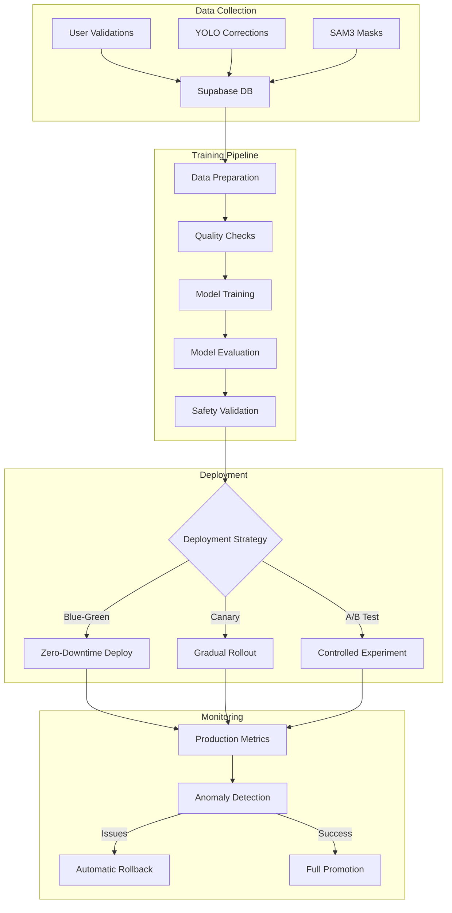

# ML Training Pipeline - Building Surveyor Feature

## Overview

The Mintenance ML Training Pipeline is a comprehensive automated system for continuous learning and deployment of building defect detection models. It implements state-of-the-art MLOps practices including automated data collection, model training, A/B testing, and safe deployment strategies.

## Architecture



## Components

### 1. Data Collection Service

**Location**: `apps/web/lib/services/building-surveyor/DataCollectionService.ts`

**Features**:
- Automated data validation and collection
- Human-in-the-loop validation workflow
- Shadow phase for AI decision learning
- Auto-validation for high-confidence cases
- Continuous feedback loop

**Configuration**:
```typescript
const AUTO_VALIDATION_CONFIG = {
  MIN_CONFIDENCE: 90,           // Minimum confidence for auto-validation
  MAX_INSURANCE_RISK: 50,       // Maximum acceptable risk score
  MIN_SAFETY_SCORE: 70,          // Minimum safety score
  MIN_VALIDATED_COUNT: 100,     // Required validations before automation
  SHADOW_PHASE_ENABLED: true    // Shadow mode for learning
};
```

### 2. Training Data Service

**Location**: `apps/web/lib/services/building-surveyor/YOLOTrainingDataService.ts`

**Features**:
- Export validated assessments to YOLO format
- Merge user corrections with base dataset
- Automatic train/val/test splitting
- Class balancing and augmentation
- SAM3 mask integration

### 3. GitHub Actions Workflow

**Location**: `.github/workflows/ml-training-pipeline.yml`

**Triggers**:
- **Scheduled**: Weekly on Sundays at 2 AM UTC
- **Manual**: Via workflow dispatch with parameters
- **Automated**: When validation threshold reached
- **Event-based**: On data collection milestones

**Jobs**:
1. **Data Preparation**: Fetch and validate training data
2. **Model Training**: Train YOLO/SAM3 models on GPU runners
3. **A/B Testing**: Configure controlled experiments
4. **Deployment**: Deploy models with chosen strategy
5. **Monitoring**: Track metrics and handle rollbacks

### 4. Training Scripts

**Location**: `scripts/ml/`

Key scripts:
- `fetch_training_data.py`: Retrieve validated data from Supabase
- `train_yolo.py`: Train YOLO models with continuous learning
- `deploy_model.py`: Deploy models with blue-green/canary strategies
- `monitor_deployment.py`: Track deployment metrics
- `rollback_deployment.py`: Emergency rollback procedures

### 5. Infrastructure

**Location**: `infrastructure/ml-pipeline/terraform/`

Components:
- **EKS Cluster**: Kubernetes for model serving
- **GPU Nodes**: g4dn.xlarge instances for training/inference
- **S3 Buckets**: Model storage and versioning
- **ECR**: Container registry for model images
- **SageMaker**: Alternative training infrastructure
- **CloudWatch**: Monitoring and alerting

## Deployment Strategies

### Blue-Green Deployment

Zero-downtime deployment with instant rollback capability:

```python
deployer.deploy_blue_green(
    model_package="model.tar.gz",
    health_check_url="https://api.mintenance.com/health/ml",
    rollback_on_failure=True
)
```

**Process**:
1. Deploy new version to green environment
2. Run health checks and smoke tests
3. Switch traffic to green
4. Monitor for issues (5 minutes)
5. Terminate blue environment or rollback

### Canary Deployment

Gradual rollout with automatic promotion:

```python
deployer.deploy_canary(
    model_package="model.tar.gz",
    canary_percentage=10,
    canary_duration_minutes=30,
    auto_promote=True,
    success_threshold=0.95
)
```

**Process**:
1. Deploy canary with 10% traffic
2. Monitor metrics for 30 minutes
3. Compare with baseline performance
4. Auto-promote or rollback based on success rate

### A/B Testing Framework

Controlled experiments for model improvements:

```javascript
// Configure A/B test
{
  "model_version": "yolo-v2.1",
  "environment": "production",
  "traffic_split": 10,
  "duration_days": 7,
  "success_metrics": ["fnr", "precision", "user_satisfaction"],
  "segments": ["high_risk_properties", "commercial_buildings"]
}
```

## Continuous Learning Pipeline

### Phase 1: Data Collection (Current)
- 100% human validation
- Build high-quality ground truth dataset
- Track GPT-4 accuracy metrics

### Phase 2: Shadow Mode
- AI makes decisions but doesn't act
- All decisions reviewed by humans
- Build confidence in automation

### Phase 3: Selective Automation
- Auto-validate high-confidence cases
- Human review for edge cases
- Continuous monitoring of FNR

### Phase 4: Full Automation
- Majority of cases auto-validated
- Human experts focus on complex cases
- Active learning for model improvement

## Safety Mechanisms

### False Negative Rate (FNR) Monitoring

Critical for safety-critical applications:

```python
class CriticModule:
    def check_fnr_threshold(self, stratum: str) -> bool:
        current_fnr = self.calculate_fnr(stratum)
        threshold = self.get_threshold(stratum)
        return current_fnr < threshold
```

### Automatic Rollback Triggers

- Error rate > 5%
- P99 latency > 1 second
- FNR > configured threshold
- Memory/CPU anomalies
- Health check failures

### Human Override System

```typescript
// Emergency stop mechanism
if (criticalSafetyHazard && autoValidated) {
  await DataCollectionService.escalateToHuman(assessmentId);
  await NotificationService.alertSafetyTeam(assessment);
}
```

## Monitoring & Observability

### Key Metrics

**Model Performance**:
- Precision, Recall, F1 Score
- mAP@50, mAP@50-95
- Per-class accuracy
- Inference latency

**Safety Metrics**:
- False Negative Rate (FNR)
- Safety-critical miss rate
- Time to human escalation
- Override frequency

**Operational Metrics**:
- Training duration
- GPU utilization
- Model size
- Deployment success rate

### Dashboards

**Grafana Dashboard Config**:
```yaml
panels:
  - title: "Model Performance"
    metrics: ["precision", "recall", "mAP50"]
  - title: "Safety Metrics"
    metrics: ["fnr", "critical_misses"]
  - title: "Inference Performance"
    metrics: ["p50_latency", "p99_latency", "error_rate"]
  - title: "Data Pipeline"
    metrics: ["validations_per_day", "auto_validation_rate"]
```

### Alerts

**Critical Alerts**:
```yaml
- name: HighFalseNegativeRate
  condition: fnr > 0.05
  severity: critical
  action: rollback_and_page

- name: ModelDegradation
  condition: mAP50 < baseline * 0.9
  severity: warning
  action: notify_ml_team

- name: InferenceLatencyHigh
  condition: p99_latency > 1000ms
  severity: warning
  action: scale_up_inference
```

## Usage Guide

### Manual Training Trigger

```bash
# Trigger training via GitHub Actions
gh workflow run ml-training-pipeline.yml \
  --field training_mode=incremental \
  --field model_type=yolo \
  --field deploy_environment=staging
```

### Local Development

```bash
# Setup environment
python -m venv venv
source venv/bin/activate
pip install -r requirements-ml.txt

# Fetch training data
python scripts/ml/fetch_training_data.py \
  --output-dir ./data \
  --min-samples 100 \
  --include-corrections

# Train model locally
python scripts/ml/train_yolo.py \
  --data-yaml ./data/data.yaml \
  --epochs 50 \
  --batch-size 8 \
  --mode experimental

# Evaluate model
python scripts/ml/evaluate_model.py \
  --model-path runs/train/exp/weights/best.pt \
  --test-data ./data/test
```

### Infrastructure Deployment

```bash
# Deploy ML infrastructure
cd infrastructure/ml-pipeline/terraform

# Initialize Terraform
terraform init

# Plan deployment
terraform plan -var="environment=staging" -var="alert_email=ml-team@mintenance.com"

# Apply changes
terraform apply -auto-approve

# Get outputs
terraform output -json > infrastructure.json
```

## Cost Optimization

### Training Costs

**Estimated Monthly Costs**:
- GPU Training (weekly): ~$200/month (g4dn.xlarge spot instances)
- Model Storage (S3): ~$50/month
- Inference (EKS): ~$300/month (t3.large + occasional GPU)
- Data Transfer: ~$100/month
- **Total**: ~$650/month

### Optimization Strategies

1. **Use Spot Instances**: 70% cost reduction for training
2. **Incremental Training**: Train only on new data
3. **Model Pruning**: Reduce model size by 50%
4. **Edge Caching**: Cache inference results
5. **Batch Processing**: Group similar requests

## Security Considerations

### Model Security

- **Model Encryption**: AES-256 for stored models
- **Access Control**: IAM roles with least privilege
- **Audit Logging**: All model access logged
- **Version Control**: Immutable model versions
- **Supply Chain**: Scan all dependencies

### Data Security

- **PII Removal**: Strip personal data from images
- **Data Encryption**: TLS in transit, AES at rest
- **Access Logs**: Track all data access
- **Retention Policy**: 90-day automatic deletion
- **GDPR Compliance**: Right to erasure support

## Troubleshooting

### Common Issues

**Training Failures**:
```bash
# Check GPU availability
kubectl get nodes -l node.kubernetes.io/instance-type=g4dn.xlarge

# Check training logs
kubectl logs -f job/yolo-training -n ml-pipeline

# Verify data quality
python scripts/ml/validate_dataset.py --data-dir ./data
```

**Deployment Issues**:
```bash
# Check deployment status
kubectl rollout status deployment/building-surveyor -n ml-models

# View deployment events
kubectl describe deployment building-surveyor -n ml-models

# Check model endpoint
curl -X POST https://api.mintenance.com/ml/predict \
  -F "image=@test.jpg" \
  -H "Authorization: Bearer $API_KEY"
```

**Performance Issues**:
```bash
# Profile inference
python scripts/ml/profile_inference.py \
  --model-path model.pt \
  --num-requests 100

# Check resource usage
kubectl top pods -n ml-models

# Analyze bottlenecks
python scripts/ml/analyze_performance.py \
  --metrics-file metrics.json
```

## Future Enhancements

### Short Term (Q1 2025)
- [ ] Implement active learning
- [ ] Add model explainability (SHAP/LIME)
- [ ] Multi-modal fusion (images + text)
- [ ] Federal learning support
- [ ] Real-time training updates

### Medium Term (Q2-Q3 2025)
- [ ] Custom hardware accelerators
- [ ] Edge deployment (mobile/IoT)
- [ ] AutoML integration
- [ ] Synthetic data generation
- [ ] Cross-property transfer learning

### Long Term (Q4 2025+)
- [ ] Proprietary foundation model
- [ ] Real-time video analysis
- [ ] 3D reconstruction from images
- [ ] Predictive maintenance ML
- [ ] Autonomous inspection drones

## References

- [YOLO Training Best Practices](https://docs.ultralytics.com/guides/)
- [MLOps Principles](https://ml-ops.org/)
- [Kubernetes ML Patterns](https://kubernetes.io/docs/tasks/ai-ml/)
- [AWS SageMaker Documentation](https://docs.aws.amazon.com/sagemaker/)
- [Safety-Critical ML Guidelines](https://arxiv.org/abs/2105.02312)